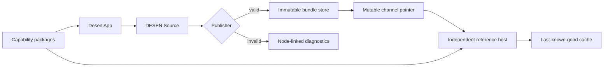

# Architecture

## System responsibility

The implementation keeps four authorities separate:

1. The protocol defines valid data and observable semantics.
2. Capability packages define trusted component, behavior, operation, and resource contracts.
3. Desen App owns editable design source for managed surfaces.
4. A host application owns executable code, authorization, integrations, and activation policy.



## Dependency direction

Cross-package imports are deny-by-default. A package may use relative imports within itself and
only the internal packages listed below:

| Package                 | Allowed internal dependencies                                                          |
| ----------------------- | -------------------------------------------------------------------------------------- |
| `protocol`              | none                                                                                   |
| `validator`             | `protocol`                                                                             |
| `publisher`             | `protocol`, `validator`                                                                |
| `catalog-sdk`           | `protocol`                                                                             |
| `runtime-core`          | `protocol`, `validator`                                                                |
| `runtime-react`         | `protocol`, `runtime-core`                                                             |
| `runtime-web`           | `protocol`, `validator`, `runtime-core`                                                |
| `editor-core`           | `protocol`, `validator`                                                                |
| `editor-web`            | `protocol`, `validator`, `catalog-sdk`, `editor-core`, `runtime-core`, `runtime-react` |
| `reference-catalog-web` | `protocol`, `catalog-sdk`, `runtime-react`                                             |
| `testkit`               | implementation package public APIs, except the `desen` facade                          |
| `desen`                 | protocol, validation, publication, runtime, catalog, and dedicated test APIs           |

Applications are composition roots but still have explicit allowlists. The reference host cannot
import editor or publisher packages, and the control plane cannot import renderer or editor
packages. Packages never import applications. Production package source never imports `testkit`;
only test code and the future dedicated `desen/test` facade may expose it.

`dependency-cruiser.config.cjs` is the executable authority for this table. Any new edge requires
an architecture review, a matching documentation change, and a negative boundary fixture.

`runtime-core` accepts a verified bundle, exact catalog set, and host ports. It produces
JSON-serializable state snapshots, diagnostics, and render plans. `runtime-react` translates those
plans into registered React components. This keeps protocol execution semantics reusable by a
future native renderer.

`catalog-sdk` owns only framework-neutral catalog documents, manifest builders, schema-derived
types, and contract derivation. A target capability package may publish inert parity metadata, but
a target renderer owns executable adapter registration; `runtime-react` therefore owns React
component adapter types and registries. A catalog package may depend on both, but React types never
cross the `catalog-sdk` public boundary. ADR 0007 records why parity metadata precedes, but never
replaces, the M05 registry.

## Reference capability artifact boundary

M03-T10 packages the exact reference sign-in slice as
`run.desen.reference.sign-in@0.1.0` for `web-react`. Its logical content-addressed artifact contains
the projected canonical Catalog and every regular file in the target package's clean `dist/**`
tree. JavaScript, declarations, and both source-map forms are included by path and exact bytes.
Two isolated builds and the workspace build must expose the same complete inventory and bytes.

The generated `catalog.json` is an inert, explicitly exported package data file. Its
`packageDigest` is calculated over the Catalog projection and distribution inventory; the final
digest and tuple are not embedded in a fingerprinted JavaScript file. The boundary deliberately
does not claim an npm archive, dependency closure, signature, distributor, or activation policy.
Those are later release and runtime responsibilities.

This artifact proves a stable contract-to-bytes identity but does not perform component lookup.
Executable registry construction, render-plan materialization, event bridging, command dispatch,
and operation execution remain owned by M05 and the host composition roots.

## Applications

### Desen App

The visual authoring product. It edits a DESEN Source directly, renders production adapters in the
canvas, provides schema-driven controls, switches between Design and Run modes, and sends valid
sources to the publisher.

### Reference Host Web

A separately built production-like application. It knows no authoring UI and contains no manual
managed-screen composition. It fetches a channel, verifies and stages a bundle, resolves exact
capabilities, then atomically activates it.

### Control Plane API

A small local-first service with three conceptual stores:

- editable sources;
- immutable bundles keyed by revision; and
- mutable channel pointers such as `preview` or `production-proof`.

Storage details are replaceable through repositories. The proof may begin with SQLite and local
immutable files; production storage is intentionally deferred.

### DESEN Developer Platform (`desen.run`)

The future developer documentation application. It will publish versioned protocol snapshots,
SDK guides, API reference, conformance results, compatibility tables, security guidance, and an
App-independent host integration quickstart. It is a developer surface, not a separate visual
authoring product.

## Platform-neutral host ports

The core receives capabilities through explicit interfaces for:

- operations and resources;
- navigation;
- tokens and environment values;
- storage and active-revision persistence;
- clock and scheduling;
- diagnostics; and
- platform adapter lookup.

No core API accepts `ReactNode`, DOM events, selectors, class names, arbitrary HTML, or executable
functions inside a DESEN document.

## Runtime value boundary

The runtime composes one factory-branded, detached, recursively frozen snapshot for `state`,
`context`, `resource`, `operation`, `event`, `item`, and `env`. Those maps come from an already
validated active surface and the current evaluation turn; the snapshot factory enforces inert
data, exact lifecycle/event envelopes, and limits rather than reopening the Bundle or Catalog.

Literal/reference/fallback resolution produces exactly one complete JSON candidate or an explicit
unresolved, invalid, or deferred result. Missing differs from JSON `null`; fallback cannot invent
an absent declaration root or revive an inactive event scope. References traverse own object
properties but never arrays, never trigger writes or host effects, and never evaluate
reference-shaped scope data a second time.

Snapshot input, ValueSpec input, and the final composed output all share the same bounded profile.
The output is detached and budgeted again so repeated references cannot amplify individually legal
values past depth, node-occurrence, or string limits. Exact consumer-schema validation still runs
after resolution and before any value reaches a target adapter.

Token and string-format materialization is an additive layer over that preserved reference
primitive. It receives the branded snapshot together with an explicit trusted token port and
request context; it never discovers a global provider or owns a token document. One top-level
materialization performs one lookup per unique opaque token name in deterministic traversal order,
then reuses the detached immutable outcome. Missing is reported as a token-specific
`REFERENCE_UNRESOLVED`; thrown callbacks, malformed outcomes, and unsafe provider values fail with
a redacted `ADAPTER_FAILURE`.

Formatting uses the closed PF-017 single-pass `{name}` grammar. Nested values materialize in the
same snapshot and token context, raw strings are inserted unchanged, and every other JSON value is
encoded as RFC 8785 canonical JSON. Formatting performs no expression, prototype, locale, markup,
or platform evaluation. Any child failure rejects the complete composite, and the expanded output
is detached and checked against the same safety limits. It remains a candidate until the exact
consumer schema is validated at the M05 adapter boundary.

## Runtime predicate and presence boundary

Predicate evaluation is a data-only layer over the same factory-branded resolution snapshot. The
core recognizes exactly the thirteen DESEN 0.1.0 operators: `all`, `any`, `not`, `eq`, `neq`, `gt`,
`gte`, `lt`, `lte`, `in`, `contains`, `exists`, and `truthy`. It accepts no expression text,
callable resolver, property accessor, capability implementation, or platform object.

Every predicate is detached and validated completely before evaluation. Its operands are then
resolved against one immutable snapshot and evaluated depth-first from left to right without
short-circuiting. This keeps dynamic type diagnostics complete and in stable document order even
when an earlier `all` or `any` argument already determines the boolean result. A direct unresolved
ValueSpec makes its current predicate false; a nested predicate that completed with false remains a
normal boolean operand for its parent. Runtime type mismatches likewise make their current
predicate false and emit `PREDICATE_TYPE_MISMATCH` at the exact argument pointer.

`eq`, `neq`, and array membership use RFC 8785 canonical JSON identity. String ordering and
substring membership use exact UTF-16 code-unit semantics without locale collation, normalization,
or case folding. `exists` probes the original `$ref` without selecting its fallback and treats
resolved JSON `null` as existing.

The M04-T04 entry point remains deliberately T02-only. Token and format operands retain an exact
`deferred` result; they are not coerced to false and they do not introduce an executable resolver
callback. M04-T05 composes those prepared operand positions with the M04-T03 materializer through
package-internal data outcomes.

Conditional presence is an instantiation boundary, not a styling instruction. An omitted `when`
is present, an evaluated false predicate is absent, and invalid or deferred input remains absent
fail-closed under a distinct status. An absent node's descendants must not be mounted. Reactive
reevaluation now runs through the M04-T15 consistent-snapshot boundary, while M04-T16 proves that
complete headless materialization leaves no descendant resource, behavior, event, or command
active.

Predicate input and the aggregate of resolved operand occurrences share the runtime depth,
JSON-occurrence, and UTF-16 budgets. The tree adds a 64-predicate-node ceiling (root plus 63 nested
nodes) and a 4,096-argument-occurrence ceiling while preserving the protocol's 64-argument
per-operator maximum. Each resolved operand is charged immediately in document order; the first
invalid/deferred terminal retains precedence, and a budget crossing stops before later values are
copied. Results and diagnostics are recursively immutable and expose no partial boolean on
malformed, hostile, deferred, or over-budget input. This layer remains independent of React, React
Native, DOM, CSS, browser APIs, and application code.

## Runtime Variant and style-override boundary

Ordered Variant evaluation is a data-only selection layer over the same factory-created resolution
snapshot. It accepts only base prop/style ValueSpecs and closed conditional patches; structural
node fields are outside the API. Variants cannot add or remove children, replace capabilities,
attach behaviors, alter repeats, or install event handlers.

Conditions are prepared through the predicate data seam and completed through the token/format
materializer against one snapshot, one captured request context, and one turn-scoped token session.
The session caches one detached observation per unique opaque token name across all sibling
conditions. Operand outcomes remain paired with their exact prepared positions, and evaluation
retains Variant array order, source-prefixed predicate diagnostics, and first-terminal failure
order. Aggregate condition results and retained token values remain independently bounded.

Base paths are selected first and every matching Variant applies in document order. A later match
can replace only `/props/{name}` or `/style/{state}/{part}/{property}` when it declares that leaf.
Literal objects and arrays inside either ValueSpec are replaced whole rather than recursively
merged; JSON `null` is not deletion; and visual-state maps never implicitly cascade from `base`.
Every winning leaf retains its exact Source/Bundle JSON Pointer.

The successful boundary returns detached, recursively immutable effective raw ValueSpecs, matching
Variant indexes, winning provenance, and ordered predicate diagnostics. JSON object-member order
has no runtime meaning; deterministic bytes use the protocol's RFC 8785 serializer. The boundary
does not materialize the selected prop or style values. Consumer-schema validation and adapter
delivery remain M05, as do active visual-state selection and target-specific styling. Reactive
reevaluation composes these pure evaluators through M04-T15, while M04-T16 owns complete headless
materialization. The
Variant-order portion of N-014 is covered here, but N-014 remains `PLANNED` until its remaining
array-order owners complete.

## Runtime reactive publication boundary

Reactive execution has a pre-mount and post-mount phase. Before resource or operation authorities
exist, the composition root creates one factory-authenticated reactive host aggregate. Only
resource and operation settlement callbacks are wrapped. Raw synchronous, Promise-like, Proxy, or
thenable outcomes are reduced to bounded immutable envelopes before a lifecycle manager can
observe them. Reentry during that reduction therefore creates a newer attempt before the older
inert envelope is delivered, allowing the manager's existing attempt identity to reject it.

After state, resource, and operation authorities mount, one surface-local coordinator samples
their exact snapshots together with complete detached context and environment values. It uses the
whole-surface reevaluation strategy explicitly allowed by DESEN 0.1.0. Context and environment
subscriptions carry no data; a trusted action/resource/operation composition root submits one
exact-snapshot invalidation after its complete turn. Reentrant notices share one dirty bit and a
bounded synchronous drain, so no browser task queue, framework scheduler, or timer gains
publication authority.

The T15 coordinator authenticates that its direct host input carries the reactive factory brand,
but the earlier public resource and operation handles do not expose which aggregate they captured.
The trusted composition root must therefore mount both managers with that same wrapped aggregate;
M04-T16 proves this complete join. The frozen 0.1.0 token port also has no subscription, so token
values refresh only when another admitted invalidation causes reevaluation. An indexed
implementation must match the whole-surface observable oracle proved at M04-T16; optimization and
performance comparison remain M12-T05.

Each evaluator candidate passes two authority checks: once before any raw-result reflection and
again after bounded JSON detachment. Both checks reread lower snapshot identity, complete host
snapshot bytes, and invalidation generation, including any notice raised by the authentication
callbacks themselves. A stale candidate is discarded. A current throw or invalid result replaces
the older active output with a controlled inactive state. Observable result generations never
wrap; the configured final generation is reserved for a terminal limit outcome. M04-T16 owns the
authenticated join to validated tree materialization, immediate event/item scope, action programs,
conditional descendant cleanup, and coordinated session disposal. M05 owns concrete component
reconciliation and platform adapter behavior.

## Complete headless session composition

The M04-T16 composition root accepts unknown Bundle and Catalog values, validates both through the
cumulative execution-contract boundary, recalculates the exact Bundle revision, and prepares every
managed surface before creating a live session. It creates one reactive host aggregate and passes
that exact object to the resource, operation, action, and reactive managers. This establishes joint
host provenance without adding a platform object, renderer, registry, or executable callback to
protocol data.

Complete materialization traverses the validated surface in source and repeat order. Conditional
presence is decided before a node, its attached behaviors, its handlers, or any descendant can
become active. Repeats reuse authenticated T07 scopes and stable identities; props, styles, tokens,
formats, and ordered variants reuse the earlier pure evaluators. The public result is a bounded,
immutable JSON plan. Receiving-schema validation and delivery to a concrete adapter remain M05.

The reactive evaluator publishes only a compact canonical commitment containing the plan and
binding digests. The complete plan, immediate item/repeat scope, and inert handler selectors remain
in an evaluation-bound private sidecar. A session may reconcile bindings only when T15 publishes
the exact evaluator id and both matching digests. Component bindings are reconciled before their
owned behaviors, obsolete bindings are removed in reverse dependency order, and an unexpected
partial failure ends the surface rather than exposing a partial registry.

An incoming adapter event is accepted only through the exact current T14 ticket. Its component or
behavior selector chooses one preprepared T13 program, while state, context, resource, operation,
event, item, and environment namespaces are rebuilt from their authenticated current owners.
Callers cannot provide an alternate namespace or claim an arbitrary runtime instance. The
official sign-in operation settlement is observed through its exposed settlement promise so
failure, retry, stale replacement, success navigation, and the new home lifetime publish in a
deterministic order. Generic notification after every future internally nested settlement remains
an explicit nonclaim because T13 does not expose that completion seam.

Every public session observation is callback-free, recursively frozen JSON with a monotonic
bounded generation, canonical plan and binding digests, and deterministic binding order. Session
disposal revokes T15 first, then T14 while its mirrored command targets can still be removed, and
finally T13 with its surrendered child managers. Reentrant disposal waits for the active bridge
callback to unwind before completing that order, and a current terminal T15 outcome disposes the
session rather than exposing an unrecoverable stale plan as live. The resulting headless contract
is platform-neutral and is the observable reference that later Web–React, Android, and iOS
adapters must preserve.

## Activation sequence

```text
fetch channel
  → fetch immutable bytes
  → verify protocol and revision
  → resolve exact catalog packages
  → preflight references and limits
  → stage runtime indexes
  → durably store verified immutable bytes
  → atomically commit {active revision, previous-good revision, generation}
  → expose the committed active snapshot in memory
```

The durable activation record and the previous-good pointer are one transaction, not two writes.
The runtime must not expose the staged revision before that transaction commits. A failure or
crash before commit leaves the prior activation record untouched. A crash after commit but before
the in-memory notification recovers the committed revision on restart; it never constructs a
partially updated pointer set.

Concurrent activations use an expected generation or equivalent compare-and-swap guard so a stale
stage cannot overwrite a newer committed revision. Fault-injection tests cover failure before
every stage, transaction abort and quota failure, crash immediately before and after commit, stale
concurrent writers, and restart recovery.

## Mobile expansion

DESEN 0.1.0 proves exactly `web-react`. A future native implementation adds a target-specific
catalog and renderer while reusing protocol-observable trace vectors. It does not assume that Web,
iOS, and Android components are identical or that one source automatically has pixel-identical
output across platforms.
