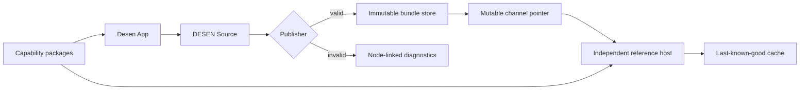

# Architecture

## System responsibility

The implementation keeps four authorities separate:

1. The protocol defines valid data and observable semantics.
2. Capability packages define trusted component, behavior, operation, and resource contracts.
3. Desen App owns editable design source for managed surfaces.
4. A host application owns executable code, authorization, integrations, and activation policy.



## Dependency direction

Cross-package imports are deny-by-default. A package may use relative imports within itself and
only the internal packages listed below:

| Package                 | Allowed internal dependencies                                                          |
| ----------------------- | -------------------------------------------------------------------------------------- |
| `protocol`              | none                                                                                   |
| `validator`             | `protocol`                                                                             |
| `publisher`             | `protocol`, `validator`                                                                |
| `catalog-sdk`           | `protocol`                                                                             |
| `runtime-core`          | `protocol`, `validator`                                                                |
| `runtime-react`         | `protocol`, `validator`, `runtime-core`                                                |
| `runtime-web`           | `protocol`, `validator`, `runtime-core`                                                |
| `editor-core`           | `protocol`, `validator`                                                                |
| `editor-web`            | `protocol`, `validator`, `catalog-sdk`, `editor-core`, `runtime-core`, `runtime-react` |
| `reference-catalog-web` | `protocol`, `catalog-sdk`, `runtime-react`                                             |
| `testkit`               | implementation package public APIs, except the `desen` facade                          |
| `desen`                 | protocol, validation, publication, runtime, catalog, and dedicated test APIs           |

Applications are composition roots but still have explicit allowlists. The reference host cannot
import Desen App, editor, publisher, `testkit`, or the broad `desen` facade, and the control plane
cannot import renderer or editor packages. Packages never import applications. Production package
source never imports `testkit`; only test code and the future dedicated `desen/test` facade may
expose it.

`dependency-cruiser.config.cjs` is the executable authority for this table. Any new edge requires
an architecture review, a matching documentation change, and a negative boundary fixture.

## Editor direct Source document boundary

M08-T01 uses the frozen `desen.source` JSON graph as the editor document model itself. The public
factory accepts unknown inert data, delegates root and embedded-schema admission to the existing
DESEN 0.1.0 structural validator, and returns one detached recursively immutable Source snapshot.
The result adds no wrapper root, normalized production projection, hidden AST, node index,
executable authority, React value, DOM value, storage handle, or publication state.

Structural admission is intentionally not continuous editor validation. A Source can enter this
model while its Catalog-backed references are unresolved. M08-T09 adds a pure synchronous
Catalog-bound validator that re-admits one immutable Source snapshot per pass, preserves complete
diagnostics and dynamic obligations, and maps invalid subjects only from explicit Validator
surface/subject context. M08-T02 adds one platform-neutral
atomic insert transition over that direct graph. It addresses a node- or behavior-owned slot by
surface-local stable identity, allocates the exact requested base or the lowest free numeric
suffix in the shared node/behavior namespace, preserves every previous identity and semantic array
order, and returns a new direct frozen Source snapshot. The command cannot supply an explicit ID or
broader mutation payload. `PF-078` records why producer ownership does not grant retained caller
mutation authority; `PF-079` records the deterministic editor profile for allocation, targeting,
atomic failure, and finite limits that DESEN 0.1.0 does not otherwise prescribe.

M08-T03 extends that same direct immutable graph with three separated structural transitions.
Delete removes exactly one addressed non-root subtree while preserving the vacated own slot key
and `[]`. Move retains the subtree intact and may cross node/behavior owners or named slots; an
absent destination is created only at index zero. Reorder applies only within one owner/slot and
uses the post-removal final index. This separation makes same-slot move and cross-slot reorder
explicit errors. Root mutation, cycles, self-descendant targets, missing or ambiguous identity,
prototype-chain slot authority, accessor/symbol/extra command fields, and limit overflow all fail
atomically. Every success preserves surviving IDs and returns a fresh detached recursively frozen
direct Source.

M08-T04 adds fourteen separated content transitions without adding a mutable editor model. Base
prop and visual-state/style-part/property commands address a uniquely identified node or behavior;
base conditional presence and every variant command address a uniquely identified node. Variants
support complete indexed insert/delete, post-removal reorder, condition replacement, and prop/style
leaf updates. Set creates missing containers, while delete requires an existing path and preserves
own empty `props`, `style` state/part, and `variants` containers. Condition clear removes the
existing `when` member. Required fields must be exposed by JavaScript reflection as exact
enumerable own data descriptors. Inherited, accessor, symbol, extra-field, function-valued,
own-`toJSON`, sparse-array, malformed-Unicode, and unsafe-index shapes fail atomically; accessor
getters and `toJSON` hooks are not invoked. Reflection on an arbitrary `Proxy` may execute traps. A
forwarding Proxy that exposes the admissible shape may be accepted, while a throwing reflection
trap is contained as a controlled failure with no partial document and no change to the prior
Source. This platform-neutral boundary is not a
hostile-JavaScript or no-code-execution membrane. Missing or ambiguous identity, missing paths,
invalid positions, structural re-admission, and limit overflow likewise fail atomically. Success
preserves every identity and unaffected semantic order and returns a fresh detached recursively
frozen direct Source. `PF-081` records the profile choices that the frozen protocol does not define.

M08-T05 adds eight whole-value state and binding transitions over the same direct graph. State
declarations have explicit insert/delete lifecycle, while schema and initial edits replace one
complete existing member. Repeat commands replace only `items` or `key` on an existing repeat and
preserve its alias, limit, extensions, and untouched value. Resource-input commands create,
replace, or delete one complete ValueSpec and retain the required own input map when empty.
Deletion never cascades into references or actions. Binding values and inert state data are stored
whole without parsing, evaluation, normalization, or reference rewriting. Prototype-sensitive
input names remain own data; dotted state names remain literal declaration keys rather than a new
reference-resolution rule. Exact command shapes, detached frozen success, atomic diagnostic-only
failure, stable identity, Proxy-reflection honesty, and the common finite profile remain unchanged.
`PF-082` records the lifecycle and whole-value choices left open by DESEN 0.1.0.

M08-T06 adds six immutable event-handler and closed-action transitions. Event-handler insert/delete
and action insert/replace/delete/reorder address one unique surface-local node or behavior owner.
Canonical owner-relative RFC 6901 pointers select root event lists and recursive
`operation.invoke` `onSuccess`/`onFailure` settlement lists; reorder uses the post-removal final
index. Removing the last value deliberately retains empty event maps, event action arrays, and
settlement arrays. All seven DESEN 0.1.0 action variants remain whole inert data: guards, navigation
parameters, operation and component inputs, event payloads, nested actions, and extensions are not
executed or semantically resolved. Exact own-data command shapes, detached frozen success, atomic
diagnostic-only failure, stable identity, structural re-admission, and Proxy-reflection honesty
retain the earlier command boundary. The event/action profile additionally admits at most 25,000
action occurrences per selected owner and action nesting depth 64 with root actions at zero.

M08-T07 adds no new transition or runtime export. It proves an in-memory parsed-value round trip
over the existing factory and all 32 immutable commands. Root `authoring` remains detached,
recursively immutable, producer-owned data through every successful transition. Two otherwise
identical Sources that differ only in root authoring retain those distinct complete values while
producing identical authoring-excluded projections and identical protocol Source digests. A root
extension change, by contrast, changes the Source digest, so the exclusion remains exactly
root-authoring-only.

Unknown extension values are preserved at all 16 Source-reachable locations: the Source root, all
seven closed action variants, variants, behaviors, repeats, nodes, state declarations, resource
instances, surfaces, and Source catalog requirements. Nested arrays, objects, apparent core fields,
recommended reverse-domain keys, and legal non-namespaced keys remain inert data. The editor does
not interpret, resolve, normalize, or reject them solely because of their names. This proves exact
parsed JSON value preservation, not lexical whitespace or object-member byte-order preservation.
Authoring- or extension-shaped fake IDs and actions do not enter allocator, identity, or action
scans, and root authoring is charged to the full 8 MiB Source limit. Extension lifecycle follows
the owning transition: insert-supplied markers enter, move/reorder carry them, delete removes only
the deleted target, and whole-value replacement replaces that target's old extension while
unrelated markers survive. Preservation does not apply to an owner deliberately deleted or
replaced by the requested command. `PF-084` records this boundary.

M08-T08 adds persistence without granting platform authority to editor-core. The core package
defines `DesenEditorPersistenceAdapter`: one `readSource` operation and one generation-guarded
`compareAndSetSource` operation. `createDesenEditorPersistencePort` exposes `openSource` and
`saveSource` over that injected adapter. It canonicalizes the complete direct Source—including root
`authoring` and every extension value—enforces the 8 MiB ceiling, re-admits adapter bytes, and
returns detached recursively frozen results. It imports no browser, React, DOM, Node, filesystem,
SQLite, or concrete transport. Generation creation, exact compare-and-set, unchanged saves,
conflicts, exhaustion, definite failures, and indeterminate outcomes remain explicit. A write whose
settlement cannot be authenticated is not retried or merged; the caller must reopen.

`@desen/editor-web` supplies the local transport adapter. Its authority is intentionally lexical
and injected: only exact `http://127.0.0.1:<port>` origins are accepted, and the caller must supply
the fetch-shaped callback and bearer token. Requests reject redirects and use the M07-T05 GET/PUT
Source route and generation headers. There is no global-fetch fallback, automatic retry, merge,
filesystem path, SQLite handle, or remote-origin mode. The existing control-plane
`openLocalControlPlane` implementation remains the unchanged filesystem/SQLite durability
authority. This keeps the composition direction explicit:

```text
editor-core open/save port
        ↓ injected adapter
editor-web exact loopback HTTP adapter
        ↓ explicit fetch-shaped callback
control-plane local Source API → SQLite/filesystem
```

The integration proof uses two independently opened control-plane instances over one OS-temporary
native SQLite database. It demonstrates a single generation-3 CAS winner, one stale conflict,
close/reopen durability, and preservation of root authoring plus all 16 Source-reachable extension
locations. A PUT dispatched to durable storage with its response hidden returns `indeterminate`;
reopen resolves the committed winner. `PF-085` records the port, adapter, and uncertainty profile.

Insertion, structural edits, content edits, state/binding edits, and event/action edits remain
structurally authoritative rather than Catalog-semantic: structurally valid unresolved capabilities,
slots, props, style parts, visual states, tokens, references, repeats, and resource inputs may remain
in the authoring graph. M08-T09 diagnoses them against one captured Catalog set without changing
the document or persistence generation. The common profile keeps canonical documents at 8
MiB, selected surfaces at 25,000 identity occurrences, component depth at 64 with root at zero,
and capability IDs at 4,096 code units where a command carries one. `N-012`, `N-014`, `N-018`,
`S-002`, and `S-003` are `TESTED`; reverse-domain naming remains guidance rather than a new hard
validator rule. M08-T09 keeps Catalog and complete-Source fingerprints separate, includes root
`authoring` in the document identity, leaves subjectless diagnostics explicitly unmapped, and does
not execute dynamic obligations. Selection, viewport, undo/redo, action execution, multi-user
synchronization, and remote persistence remain outside the completed M08 boundary.

The cumulative M08 proof closes each boundary against the emitted public package as well as the
source. Editor-core depends only on `protocol` and `validator` and has zero platform imports or
executable authority; the concrete loopback transport remains in editor-web. M08-T10 authenticates
every frozen M08-T01–M08-T09 artifact, copies exact emitted bytes into two independent temporary ESM
graphs, and executes the same deterministic 32-step command transcript in both. Its stable-identity
ledger shows that insertion adds one identity, deletion removes only its selected prepared subtree,
and all other transitions preserve the complete node/behavior identity multiset. The terminal
Source validates with zero diagnostics and seven retained obligations and survives the M08-T08
port's exact generation-one save/open round trip.

The terminal platform audit parses all nine editor-core TypeScript source files, all nine emitted
JavaScript files, and all nine emitted declaration files with the TypeScript AST. The graph contains
only relative, `@desen/protocol`, and `@desen/validator` edges and no React, ReactDOM, DOM/browser,
Node-platform, CSS, dynamic-import, evaluation, or function-constructor authority. Its complete
callback-free trace is JSON-serializable and stable under RFC 8785 canonicalization. Together with
the M01-T05, M04-T16, and M04-T17 prerequisites, this closes P-18 as `PROVEN` and G08 as `DONE`.
It does not claim a React renderer or DOM behavior, a hostile-JavaScript sandbox, concrete durable
storage/network authority, or editor selection, viewport, undo/redo, or collaboration policy.

`runtime-core` accepts a verified bundle, exact catalog set, and host ports. It produces
JSON-serializable state snapshots, diagnostics, and render plans. `runtime-react` translates those
plans into registered React components. This keeps protocol execution semantics reusable by a
future native renderer.

`catalog-sdk` owns only framework-neutral catalog documents, manifest builders, schema-derived
types, and contract derivation. A target capability package may publish inert parity metadata, but
a target renderer owns executable adapter registration; `runtime-react` therefore owns React
component adapter types and registries. A catalog package may depend on both, but React types never
cross the `catalog-sdk` public boundary. ADR 0007 records why parity metadata precedes, but never
replaces, the M05 registry.

The M05 React boundary uses a finite factory-authenticated registry populated only by statically
imported trusted adapters. Document data can select an exact registered capability id but cannot
name a module, export, loader, callback, or fallback. The standalone plan compiler performs a
complete bounded own-data preflight and detaches all JSON before it creates React elements. It
authenticates registry authority, not the provenance of any otherwise valid structural plan; the
production host must obtain that plan from its exact current headless session. ADR 0010 records
the receiving-Catalog, session interaction, semantic style, reference package, and independent-host
boundaries that complete M05.

The M05-T03 semantic-style boundary validates every final component and behavior map through the
same exact Catalog-authenticated receiving scope used for props and slots. React adapters receive
the complete immutable visual-state → declared-part → property map. `runtime-react` does not select
or merge active states, interpret property names, generate CSS, or expose DOM/component internals;
those target-specific decisions remain inside the statically trusted capability adapter.

The M05-T04 interaction boundary first requires exact two-way parity between that prepared tree and
the authenticated session's complete component/behavior binding inventory. It then commit-gates a
least-authority port per adapter instance. Events retain the captured session, snapshot, runtime
identity, and inert payload; they never carry React or native event objects. Only a committed
component may attach an opaque command owner to its exact current binding. Supersession, binding
replacement, navigation, unmount, and disposal revoke the owner without changing the lower
adapter-binding identity. Behavior adapters use the same event surface but receive no component
command authority. Bounded payload snapshotting and exact commit-epoch rechecks close hostile
reflection/unmount races. Revoked core and React authorities become inert tombstones with no
component callback or session/snapshot graph, and superseded controller entries are removed.

The M05-T05 reconciliation boundary observes session publication only through the
factory-authenticated runtime-core external-store seam. React subscribes after commit, cleans up
the exact opaque ticket during replay, replacement, or unmount, and acquires no subscription
during SSR or abandoned Suspense work. Every published exact snapshot passes the same complete
renderer authentication again. The public renderer itself wraps every successful managed tree in
a private component type that is stable for that exact session-and-registry pair and distinct when
either authority changes; the live hook therefore cannot accidentally omit or double-apply the
isolation boundary.
Stable component and behavior keys combine runtime identity, exact capability id, and an RFC 8785
canonical, presence-aware projection of only trusted
registry-declared `remountOnProps`; Bundle and Catalog data cannot choose that policy. Compatible
instances and repeated keys survive ordinary updates and reorder, while capability or declared
remount-sensitive changes create a new instance. The same complete preflight builds a bounded,
deeply frozen, callback-free runtime-node ↔ source-node diagnostic index with sorted one-to-many
inverse lookups. It retains no props, styles, slots, React or platform objects, session, Catalog,
registry, or callback.

The M05-T06 production boundary composes controlled preflight failure and committed React adapter
failure through one explicit host-owned renderer. It never guesses a placeholder. Safely isolated
leaf-component exceptions retain only immutable diagnostic identity; behavior, non-leaf, and
cleanup failures use a null-identity `ADAPTER_FAILURE` rather than falsely blaming a live ancestor.
Containment removes the complete managed surface because React exposes no public origin that makes
arbitrary sibling continuation safe. Two persistent sibling boundaries preserve provenance while
switching between the managed tree and host failure UI. Recovery is sticky and requires an
explicit host `recoveryKey`; normal publications never retry failed executable code. A dedicated
React root may opt into `ignoreRuntimeReactRootCaughtError` so React 19 does not log raw caught
adapter values before recovery. Event callbacks, arbitrary async work, SSR, uncaught root errors,
recoverable root errors, and cleanup during complete root removal remain explicit host policies.
The boundary consumes trusted runtime results, not arbitrary untrusted objects, and nested surfaces
within one tree require one deduplicated `runtime-react` module instance for private carrier
identity.

The M05-T07 reference-host boundary is a separately built, client-only React 19 application using
zero-configuration Vite 8. `runtime-web` factory-captures all nine host ports and fourteen
callbacks without invocation. The reference root reads that exact aggregate from the opaque Web
host authority and asks `runtime-core` to authenticate its object-identity join with the live
headless session; the authentication result is status-only and exposes no port or callback.
Structurally equal aggregates do not pass. The root also authenticates the exact current session
snapshot and Catalog set, then uses a second status-only `runtime-web` authority check to require
that snapshot's document id and revision to equal the host's configured pair. The root accepts
only a closed `RuntimeReactLiveSurfaceInput` and authenticates its factory-created executable
registry through runtime-react's callback-free public reader before ownership transfer. It serializes
activation/replacement/retry/disposal through one transition fence, and cannot receive arbitrary
React composition or a caller-selected recovery key.

The dedicated root ignores caught-error telemetry through the exact runtime-react policy.
Recoverable errors emit only a fixed redacted signal. Uncaught errors terminally fence the
session and host before that fixed signal is reported; raw errors and React error information are
never inspected or forwarded. Explicit retry or replacement of the exact session, registry,
Catalog set, or host authority advances the sticky recovery epoch. Bundle/revision values,
snapshots, renderer results, and ordinary publication cannot. Terminal tombstones sever the heavy
authority graph. The browser profile preserves its last valid bounded environment after a hostile
read, uses a finite nondecreasing epoch clock, and attempts every listener cleanup independently.
A failed or otherwise uncertain React unmount keeps a weak claim on the container so a second root
cannot be attached to uncertain live state.

The M05-T08 application composition imports the controlled official-derived sign-in Bundle, the
exact current reference Catalog, and the public real five-adapter registry. It creates the
browser's nine-port authority, mounts the Bundle through `runtime-core`, and transfers only the
authenticated `RuntimeReactLiveSurfaceInput` plus its exact Web-host authority to the T07 root.
The managed `surfaces` bytes are canonically identical to the frozen official example; the
derived fixture changes only the Catalog tuple and the consequent Source and Bundle digests.

The production operation adapter has one fixed transport shape: one same-origin
`POST /api/sign-in` request with bounded snapshotted credentials. Only HTTP `401` maps to the
declared `invalidCredentials` result. Other HTTP statuses and all network, response, parse,
malformed-data, and response-budget failures map to the declared `unavailable` result without
retries or raw-value forwarding. Successful bodies cross a 64 KiB and 1,024-non-empty-chunk
streaming ceiling before JSON parsing; the resulting bounded JSON remains subject to runtime-core's
exact output schema. Real reference adapters drive pending, declared failure, edited retry,
success, and `/home` navigation. Their loading `Button` suppresses further presses while the
operation is pending.

Exact composition replacement creates a new session, registry, Catalog, and Web-host authority
and transfers them atomically to the root. The root disposes the former owned session and host;
events from its detached adapter instances and a late operation settlement cannot update or
navigate the replacement surface. This is an authority and stale-settlement guarantee, not
transport cancellation: an already-started fetch is not aborted. The immutable T07 artifact
remains historical task-time evidence, while T08 owns the current composition and build
verification.

The M05-T09 gate audits every dynamically discovered reference-host production source with the
TypeScript parser/checker and observes the real Vite 8 `write:false` production graph twice.
TypeScript resolves JSX, import aliases, namespaces, and symbol origins while the complete-source
policy and exact composition fingerprints reject helper-hidden trees; Vite is the authority for
the modules and static edges resolved by the actual production build. Exact root, application,
managed-boundary, and controlled-failure JSX is the only host-authored tree. Every managed
component path crosses the public `@desen/runtime-react` renderer and public
`@desen/reference-catalog-web/react-adapters` factory. Orphan source, direct or hidden component
composition, React factory bypasses, plan-shaped substitutes, dynamic loading, private package
paths, forbidden applications, authoring Source data, symbolic links, and unreviewed assets fail
closed. Dependency-cruiser remains an independent package-boundary authority. This completes the
separate-host claim required by G05 without claiming the later Desen App E2E slice.

Page lifecycle disposal is BFCache-aware. Persisted `pagehide` keeps the active composition and
listener intact for restoration; a non-persisted `pagehide` removes the listener and disposes the
root, session, and host. This is covered in React/jsdom and does not claim real-browser BFCache
conformance.

`@desen/reference-catalog-web/react-adapters` is the opt-in executable package boundary. Its five
registrations statically import the real reference components, map validated fields explicitly,
and implement the declared `focus`, `change`, and `press` interaction primitives without dynamic
loading, arbitrary prop spread, DOM handles, or native-event leakage. Adding this subpath changes
the package's complete logical `dist/**` inventory, so the current Catalog carries the successor
digest while the M03 tuple remains immutable historical evidence.

## Reference capability artifact boundary

M03-T10 packages the exact reference sign-in slice as
`run.desen.reference.sign-in@0.1.0` for `web-react`. Its logical content-addressed artifact contains
the projected canonical Catalog and every regular file in the target package's clean `dist/**`
tree. JavaScript, declarations, and both source-map forms are included by path and exact bytes.
Two isolated builds and the workspace build must expose the same complete inventory and bytes.

The generated `catalog.json` is an inert, explicitly exported package data file. Its
`packageDigest` is calculated over the Catalog projection and distribution inventory; the final
digest and tuple are not embedded in a fingerprinted JavaScript file. The boundary deliberately
does not claim an npm archive, dependency closure, signature, distributor, or activation policy.
Those are later release and runtime responsibilities.

This artifact proves a stable contract-to-bytes identity but does not perform component lookup.
Executable registry construction, render-plan materialization, event bridging, command dispatch,
and operation execution remain owned by M05 and the host composition roots.

## Publisher Catalog authority boundary

The M06 Publisher resolves a Source Catalog requirement only against a closed, caller-supplied
inventory of target-profile package observations. Matching is exact for `id`, `version`, and the
optional `target`; `location` remains a discovery hint, and candidate order, version ranges,
Unicode normalization, or equal Catalog JSON never establish authority. Zero or multiple matches
fail before a Catalog can enter later publication stages.

One unique selection is captured as bounded inert data, structurally validated, checked against
its candidate tuple and preobserved package digest, and admitted into one immutable Catalog
namespace. The resolver itself performs no filesystem, network, registry, loader, or target
adapter operation. The caller remains responsible for obtaining `observedPackageDigest` from the
applicable deterministic package-byte profile; M07 independently verifies installed package
bytes before activation. A failure exposes no partial Catalog set, selected package authority, or
Bundle.

## Publisher phased Source preflight boundary

M06-T03 keeps the terminal Publisher private and composes one nonterminal, platform-neutral
preflight in causal order:

1. strict raw Source JSON;
2. frozen Source-root structure;
3. every embedded Draft 2020-12 state schema;
4. exact requirement versions, entry, surface identity, and surface-local node/behavior identity;
5. M06-T02 Catalog selection, integrity, and namespace authority; and
6. the exact Source-to-Catalog relation plus component, behavior, resource, and nested-operation
   static references.

Catalog candidates remain completely unobserved through step 4. The split is intentional:
Catalog-independent Source errors must win without touching candidate input, but capability
existence and category cannot be decided until a trusted Catalog set exists. An invalid Catalog
therefore precedes an indeterminate static-reference error; once Catalog authority is valid, an
unknown or wrong-category reference retains its exact Source pointer and the `source-semantics`
stage. `PF-062` records this distinction between logical stage ownership and causal authority
order.

The Validator authenticates the exact prepared Source and Catalog set with module-private runtime
metadata. The Publisher success carries those authorities, selected immutable package tuples, and
requirement alignment, but remains package-private, nonterminal, and contains neither `ok` nor a
Bundle. Its outer `PublishSourcePreflightSuccess` object is frozen but is not itself runtime
branded. Immediate in-package composition is therefore the current safety boundary. A later
Publisher stage must not accept a caller-supplied or reconstructed outer shell; it must
authenticate the exact preflight result identity or independently revalidate coherence among the
Source, Catalog set, packages, and alignment.

Every rejection uses the M06-T01 failure shell and exposes no Source, Catalog set, selected
package, alignment, partial value, or Bundle. One common diagnostic profile bounds task-owned
reports and inherited M06-T01/M06-T02 reports; under-budget inherited failures remain unchanged,
while an over-budget report becomes one redacted
`run.desen.publisher/SOURCE_PREFLIGHT_LIMIT_EXCEEDED` error at the original stopped stage.

This boundary does not validate the M06-T04 capability contracts or M06-T05 dynamic obligations,
normalize or hash Source data, pin or validate a Bundle, calculate a revision, emit a Bundle, or
perform discovery, download, activation, rendering, signing, publication, or deployment.

Evidence:
`docs/proof/artifacts/publisher-0.1.0-source-preflight.json`
`sha256:07537cc034d99dec3cb887805381f58a550de3a0dcb694564ab6a20ac760a387`.

## Publisher static capability preflight boundary

M06-T04 immediately composes the exact M06-T03 authority rather than accepting a caller-created
stage shell. The exact selected Catalog array first crosses the Validator's interaction-contract
preparation authority; only then may the exact prepared Source be checked for statically knowable
component props and Variants, slots and accepted children, styles and visual states, events and
commands, behavior props and slots, behavior styles and events, attachment, and conflicts.
Unsafe Catalog contract schemas therefore fail before Source capability values are observed.

The Publisher retains the exact M06-T03 Source, packages, Catalogs, and requirement alignment. It
does not accept the Validator's cloned Source output or expose dynamic obligations at this
boundary. Success is still package-private and nonterminal, with neither `ok` nor `bundle`; every
blocking failure uses the M06-T01 shell and exposes no partial authority.

Deprecation discovery runs only after static success. Exact component, behavior, resource, and
operation use sites may emit the public fixed
`run.desen.publisher/DEPRECATED_CAPABILITY` warning, but Catalog-controlled prose and replacement
hints are never copied or followed. Warning order and finite budgets are deterministic. Optional
traversal fields and lower-stage discriminators must be own data properties, preventing inherited
prototype data from fabricating structure or authority.

Publication step 8 also contains resource and operation receiving contracts plus dynamic
compatibility work. The current public Validator execution entry point intentionally composes
those concerns with state, binding, action, and runtime obligations. M06-T04 therefore completes
only the static component/interaction slice; M06-T05 depends on it and closes the remaining
resource/operation and dynamic-obligation slice without importing runtime or target-framework
dependencies.

Evidence:
`docs/proof/artifacts/publisher-0.1.0-capability-preflight.json`
`sha256:2c55593b69fd5203d3fe2aeaeb8e59dc70cb4a89c4168605c581c17fd1aad56e`.

## Publisher execution preflight boundary

M06-T05 composes M06-T04 internally and accepts no caller-reconstructed intermediate. It
re-authenticates the exact prepared Source and upgrades the exact selected Catalog array through
the Validator's execution-contract authority. The same selected packages, requirement alignment,
and safe deprecation warnings remain attached to that authority; no structurally equal clone or
serialization round trip can substitute for an authenticated object.

One cumulative Validator analysis records publication-phase provenance at each diagnostic
emission site. Resource and operation schema, policy, and statically known receiving-input
failures stop at `capability-contracts`; state, predicate, repeat, action-target, and control-flow
failures stop at `state-and-control-flow`; lexical, lifecycle, format, and statically decidable
binding failures stop at `binding-compatibility`. Only the earliest non-empty phase is returned,
so simultaneous defects preserve exact publication-step 8 → 9 → 10 precedence without repeating
the cumulative walk or classifying diagnostics from their codes or pointers.

A complete success adds one normalized runtime-obligation handoff with the closed kinds
`behavior-prop`, `behavior-style-part-property`, `component-command-input`, `component-prop`,
`operation-input`, `resource-input`, `state-write`, and `style-part-property`. The handoff is
sorted, de-duplicated, deeply frozen, and bounded by 4,096 obligations, 4,096 UTF-16 code units in
one pointer, and 1,048,576 aggregate obligation and identity-context code units. A crossing rejects
the complete intermediate at `binding-compatibility`; obligations are never truncated.
Operation/resource outputs remain exact runtime receiving checks and are not fabricated as Source
obligations.

The success remains package-private and nonterminal. It emits no Bundle, performs no normalization
or hashing, and owns no runtime value, target adapter, filesystem, network, registry, activation,
rendering, signing, or deployment authority. A later blocking phase suppresses inherited warnings,
and every failure exposes no Source, Catalog, selected package, alignment, warning, obligation,
partial value, or Bundle. M06-T06 may inspect only this exact authority while proving extension,
semantic-order, and source-node identity preservation.

Evidence:
`docs/proof/artifacts/publisher-0.1.0-execution-preflight.json`
`sha256:6127bc2edd417975d4ae311b7934d9f85048928c84b1500ab50af8f42731ca67`.

## Publisher Source-preservation boundary

M06-T06 composes the exact M06-T05 function internally from raw Source JSON and closed package
candidates. It does not accept a caller-created execution-preflight shell. The authenticated
Source, execution Catalog set, selected packages, requirement indexes, safe warnings, and runtime
obligations cross by exact identity.

The task prepares two deliberately separate views:

1. the exact authenticated Source, which still contains top-level `authoring`; and
2. a shallow frozen production-field projection containing `desen`, `id`, `entry`, `surfaces`, and
   optional root `extensions`, with ordered Source Catalog requirements retained separately.

Every nested value in that projection is the exact parsed Source value. Unknown extensions stay
opaque, and semantic arrays are neither sorted, deduplicated, rebuilt, nor materialized. This is
parsed-value preservation, not preservation of raw JSON whitespace or object-member lexical
order. Actual authoring removal and deterministic normalization remain M06-T07.

An iterative schema-edge walk builds one bounded immutable trace entry for every reachable
component node. Each entry contains exactly the document id, owning surface id, unchanged Source
node id, capability id, and RFC 6901 Source pointer. Surface and slot maps use deterministic UTF-16
key order while node and behavior arrays keep their Source index order. Identity is
surface-scoped, so equal node ids on different surfaces remain legal and separately traceable.
Behavior ids remain in the preserved Source graph rather than being mislabeled as component
nodes. Node-shaped values under extensions or authoring remain opaque and never enter the trace.

The trace admits at most 25,000 records, 4,096 UTF-16 code units in one pointer, and 4,194,304
aggregate identity/pointer units. A crossing rejects the complete intermediate at `normalization`
with no truncation, inherited warning, partial authority, or Bundle. Inherited Source and execution
profiles continue to bound input data. The boundary remains package-private, platform-neutral, and
nonterminal; it performs no authoring mutation, normalization, digest, exact Bundle tuple pinning,
Bundle validation, revision calculation, runtime execution, activation, rendering, signing, or
deployment.

Evidence:
`docs/proof/artifacts/publisher-0.1.0-source-preservation.json`
`sha256:261b820b381a0d0c8005a7baf85e33464f2558bfa2a263b94dcb6fd28ddd38ff`.

## Publisher Source-digest, authoring-removal, and normalization boundary

M06-T07 composes M06-T06 internally from raw Source JSON and the closed package-candidate
inventory. It accepts no caller-reconstructed preservation result. The exact authenticated Source,
execution Catalog set, selected packages, requirement alignment, safe warnings, runtime
obligations, preservation projection, loose Source requirements, and source-node trace cross the
boundary by runtime identity.

The boundary executes the protocol's required order—Source digest, root authoring removal, then
deterministic normalization—and keeps three authorities deliberately separate:

1. the exact authenticated pre-normalization Source;
2. its DESEN Source digest, calculated before any publication-specific transformation and retained
   as a separate nonterminal result field; and
3. one detached, recursively frozen production-document base containing only Bundle `kind`,
   protocol version, document id, entry surface, surfaces, and optional root extensions.

Producing the third value performs actual top-level authoring removal. It never recursively
deletes a field named `authoring`, so opaque extension payloads retain such fields unchanged.
Loose Catalog requirements and discovery locations remain attached to the authenticated Source
authority for the next exact-pinning step; neither enters the normalized document. M06-T08
authenticates and carries the already calculated digest while replacing loose requirements with
exact tuples.

The selected DESEN 0.1.0 Publisher profile uses a minimal RFC 8785 round trip. It applies no schema
defaults, removes no empty optional member, constructs no hidden dependency index, and never sorts
or deduplicates semantic arrays. Identifiers, conditions, literals, capability ids, array order,
opaque extension values, and the T06 source-node trace therefore retain their parsed semantics.
Canonical serialization is stable across object insertion order; JavaScript in-memory own-key
enumeration is not treated as an interoperable ordering guarantee.

The production-document base is limited to 2,097,152 canonical UTF-8 bytes. Exact capacity passes;
a crossing rejects the whole intermediate at `normalization` with a redacted error and no
inherited warning or partial authority. Invalid digest authority rejects earlier at
`source-digest` under the same no-partial rule. This is an intermediate envelope, not proof that
the later complete Bundle fits the Reference Profile after exact requirements and digest fields
are added. M06-T09 must enforce that final bound again. The T07 success remains package-private
and nonterminal: it emits no exact requirement set, revision, publication metadata, Bundle,
runtime value, target adapter, activation, storage, or signing authority.

Evidence:
`docs/proof/artifacts/publisher-0.1.0-source-normalization.json`
`sha256:59cb08f75849ae4831644e746a72186227a9774ceb7bcd8281156ccbc6dd085e`.

## Publisher Source-digest authentication and exact Catalog-pinning boundary

M06-T08 invokes the complete M06-T07 boundary exactly once from raw inputs and accepts no
caller-created normalization shell. It independently recalculates `sourceDigest` from the exact
authenticated Source, requires valid SHA-256 syntax, and compares the value byte-for-byte with the
T07 authority before constructing a tuple. A failed calculation or mismatch stops at
`source-digest`; the recalculated value is never substituted into output.

Every loose Source requirement is then mapped positionally through the exact
`requirementPackageIndexes` produced by M06-T02. Tuple `id`, `version`, `target`, and `digest` come
only from the selected package and its execution Catalog. An omitted Source target is filled from
that one selected package. Requirements are neither sorted nor deduplicated: duplicate positions
retain separate tuple entries and their distinct opaque extensions.

Source `location` remains part of the authenticated Source and therefore affects the Source digest,
but it is never selection authority and never enters `requires.catalogs`. A nested `location` inside
an extension remains opaque data. This prevents both blanket recursive key deletion and accidental
whole-requirement spreading.

The result carries every T07 authority by exact runtime identity and adds one recursively immutable
`pinnedDocument`. That document contains the normalized production fields, authenticated
`sourceDigest`, and exact `requires.catalogs`; it still has no `revision`, `publication`, terminal
Bundle success, signature, runtime, host, adapter, activation, or storage authority. Complete
Bundle validation, the final 2 MiB limit, and two-stage revision closure remain M06-T09.

Evidence:
`docs/proof/artifacts/publisher-0.1.0-catalog-pinning.json`
`sha256:de37aa35bcdc67e637d323a559f104160479315f56961c962e00bfdc74459c8f`.

## Publisher complete-Bundle validation and revision-closure boundary

M06-T09 is the first public terminal Publisher boundary. `publishDesenSource` accepts only raw
Source JSON and a closed array of immutable package observations; caller-adjustable limits and all
M06-T01–T08 intermediates remain package-private. It invokes the complete M06-T08 boundary exactly
once and accepts no reconstructed stage result.

Revision creation uses a deliberate bootstrap-and-closure profile. The Publisher calculates a
provisional revision over the pinned document, adds only that `revision`, and measures the
candidate's RFC 8785 canonical UTF-8 bytes. It then invokes the cumulative Bundle execution
Validator exactly once with the exact M06-T08 Catalog set. The Validator must return an independent,
recursively immutable graph whose canonical bytes equal the candidate. The Publisher remeasures
that snapshot and recalculates its revision. Provisional, embedded, and closed revisions must all
match. This resolves the schema/revision circularity without hashing a placeholder or allowing
`revision` to hash itself.

The project interprets the Reference Profile's “2 MiB uncompressed” terminal limit as at most
2,097,152 RFC 8785 canonical UTF-8 bytes for the complete M06 Bundle. The ceiling is checked before
and after Validator snapshotting. Optional future `publication` metadata is absent; its later owner
must remeasure after adding it.

Success returns only the exact Validator Bundle snapshot and the exact authenticated M06-T08
warning array. Every inherited or terminal failure returns the closed no-Bundle shell. Malformed
stage authority, mutable or shared Validator graphs, byte-authority drift, final-size overflow,
and revision failure cannot expose a candidate, partial Bundle, Source, Catalog set, obligation,
or warning. The operation is synchronous, deterministic, platform-neutral, and has no filesystem,
network, clock, signing, storage, activation, host, adapter, editor, or deployment authority.

Evidence:
`docs/proof/artifacts/publisher-0.1.0-bundle-publication.json`
`sha256:2942aa84066354ee7c27557263a900eb8fd3a149d085ab55c7f880dcfca998df`.

## Publisher official golden and deterministic replay boundary

M06-T10 adds no Publisher implementation path. It treats the M06-T09 public package root as the
only executable publication authority and uses frozen upstream conformance documents as external
oracles. Two separately parsed Source objects and two separately cloned Catalog-package
candidates are published independently; their input, result, Bundle, and diagnostic graphs remain
identity-disjoint.

The comparison oracle removes exactly the official Bundle's own root `publication` member. It
does not omit `revision`, `extensions`, or any nested member with the same name. Both public
outputs must equal that projection as RFC 8785 canonical UTF-8 bytes and must equal one another.
The frozen sign-in golden is 2,173 canonical bytes with SHA-256
`fac0ee3d559528af2f4274cdfb21979463cbadd419f2faba584263cc8b4c0247`,
revision
`sha256:43eef0f11f9bcc4c13fc1eb5691ee974859001fbb4aeee8051948e7c8e195601`,
and Source digest
`sha256:40c294047299b521a46b51d8a72bfbeeaad8a69a9b9045a306139830b7674878`.

Root object allocation order and root-only authoring changes have no publication authority.
Semantic nested data remains significant. The golden proves deterministic valid publication and
authoring exclusion; it does not stand in for M06-T11's invalid-source precedence and no-Bundle
matrix.

Evidence:
`docs/proof/artifacts/publisher-0.1.0-official-golden.json`
`sha256:a2cde9718894b4af506e750d66ea7577d96da4e8a09649f17afe0f94dada17e2`.

## Publisher public invalid-Source and G06 boundary

M06-T11 tests only the built public Publisher root and its fixed two-argument
`publishDesenSource` operation. It adds no private publication route, injectable stage, or
case-specific production behavior. The reviewed task-owned matrix contains 127 invalid inputs and
eight positive guards. Every invalid input stops at its exact earliest naturally reachable stage
and returns only a recursively immutable, nonempty, error-first
`{ diagnostics, ok, stage }` result. A failure never exposes a Bundle or any lower Source, Catalog,
package, obligation, trace, normalization, digest, revision, or publication authority.

The boundary makes causal precedence explicit. A stage-eight capability failure wins over
simultaneous stage-nine and stage-ten defects; stage nine wins over stage ten; and stage-ten
binding failure suppresses every earlier deprecation warning. Blocking errors therefore cannot be
reclassified from their code or pointer after the fact. Dynamic obligations remain valid
successful publication work and never become fabricated static errors.

The same public matrix independently crosses each reachable default report and data envelope:
inherited parse and Catalog reports; capability and execution error reports; deprecation-warning
reports; runtime obligations; Source-node trace output; normalized-document bytes; and complete
Bundle bytes. The ordered 14-code Publisher registry records every project-owned code with its
default stage and severity. Discovery `location` remains authenticated, digest-significant Source
data but supplies no Catalog or package trust.

The deterministic `source-digest`, `authoring-removal`, `catalog-pinning`, and `bundle-revision`
stages have no natural invalid data input once their authenticated predecessors succeed. M06-T11
does not create fake public negatives for them; the exact successful M06-T07 through M06-T10
evidence remains authoritative. This boundary closes G06 for reviewed valid publication and atomic
invalid rejection only. Signing, storage, activation, deployment, runtime execution, host,
adapter, editor, network, and control-plane behavior remain later authorities.

Evidence:
`docs/proof/artifacts/publisher-0.1.0-invalid-source-matrix.json`
`sha256:fc5904ea6ec4e6495629fc4de8009fee66155938013068b709dd1ff40c1e98d8`.

## Applications

### Desen App

The visual authoring product. M09-T01 establishes its application-owned shell and project
navigation. M09-T02 composes the first Catalog-driven, read-only authoring projection into that
shell. M09-T03 adds one exact managed reference-adapter canvas, M09-T04 adds Source-identity
selection outside that managed subtree, and M09-T05 adds schema-derived primitive/enum Inspector
controls through public Editor Core and Publisher boundaries. M09-T06 consumes the recursive
control plan with closed-object controls and an explicit structured-JSON fallback without crossing
the App-owned Inspector boundary. M09-T07 adds Catalog-declared named-slot insertion, move,
reorder, and deletion through the same public mutation and publication boundaries. M09-T08 adds a
bounded surface-local primitive-state editor and exact direct local-state prop bindings without
widening the literal Inspector parser or managed runtime subtree.

The current surface-editor composition uses a route-sized workplane as the lowest application
layer. Application navigation, the command bar, a permanent vertically split Components/Layers
dock, and a right Inspector/State/Actions tabbed dock float above that plane and remain outside the
managed Runtime React output. The plane contains one centered page frame whose exact dimensions
come from the selected surface's validator-admitted Source `authoring.canvas` declaration; invalid
or missing frame metadata produces no invented fallback, and Source-space `x`/`y` values do not
place the single selected surface. Design and Run preserve the same workplane and frame
coordinates, so changing interaction mode neither moves nor resizes the authored page.

The corrective M09 compatibility successor also keeps a declared Stack `maxWidth` fluid inside
that page frame by applying `width: 100%` and `min-width: 0`; conditionally materializing the Alert
therefore cannot enlarge either the Stack or the authored page. Because this changes executable
Web–React bytes, the current package digest is
`sha256:d4a4e7e2ea2d68ab8bff085d90e093f2d31b784f0f2fb089c6422ce33914b051` over 80 regular
distribution files totaling 243,740 bytes and 81 framed entries totaling 252,637 bytes. The
official-derived Bundle revision is
`sha256:6e539a76ddd0bc9b4eff82e73508b62a3980ae5dbc73dd85ccf0c1cae6957e13`; the Source digest
remains `sha256:b8e2d6bac855fb307aaeb0636becf93834f6faeda5464bdbfbc1e8d52f379635`.
Historical task-time tuples and all frozen artifact bytes remain unchanged. Reader checkpoint
sequence 56 advances the exact sequence-55 head to
`sha256:1a2049082f981614c33fb2f1576cfd8d52e9dbd6dbb44f5177d3cf290064c51a`, preserving 49 frozen
artifacts and 98 reader identities.

The first slice owns three exact route forms: `/projects`, `/projects/:projectId`, and
`/projects/:projectId/surfaces/:surfaceId`. The bare root is replaced with `/projects`; app-owned
navigation stays on the current origin and uses the browser History API plus one private
application event. Browser traversal is observed through `popstate`. Segments are finite lowercase
kebab-case values, and unknown routes, projects, or surfaces fail closed into an explicit recovery
view. App-owned navigation destinations with credentials, a query, or a fragment are rejected.
This is an internal Web application profile, not DESEN protocol routing semantics.

Project and surface data are two fixed recursively frozen fixtures. Search filters only those inert
summaries; it does not discover, load, create, persist, or alias a project. The shell keeps future
actions visibly disabled and explained. Native landmarks and controls, a skip link, current-item
semantics, visible keyboard focus, route-heading focus, reduced-motion handling, and responsive CSS
make the bounded navigation usable without inventing editor behavior.

M09-T02 admits the exact `@desen/reference-catalog-web/catalog.json` export and the official-derived
sign-in Source only through a closed read boundary. It calls
`validateDesenInteractionCatalogSet` first, then calls
`validateDesenSourceInteractionContracts` with the accepted cumulative Catalog set. The app
projects only the validator-returned values into a recursively frozen authoring model. Catalog
rejection, unresolved Source capabilities, or the task-owned depth/occurrence limits produce a
closed failure result with no partial model.

The Components tab groups the exact Catalog component contracts by their authoring category and
filters that inert projection locally. The Layers tab preserves exact Source surface, component,
behavior, named-slot, conditional, and child-array order. A surface without an exact Source tree
shows that absence explicitly and never aliases or substitutes the sign-in tree. The hierarchy is
a read-only nested, labelled list, not an interactive ARIA tree or editor selection model.

The full-viewport project gallery, project-level surface galleries, and centered inert surface
frame remain navigation composition. Through M09-T02, the app's DESEN package edges are limited to
the inert reference-Catalog JSON and the two named Validator entry points; it does not import
editor-core, editor-web, catalog-sdk, runtime-react, adapter registries, publisher, or control-plane
code. Its five local SVG imports remain repository-owned inert assets rather than an icon package
or executable capability. The exact 25,375-byte read-panel artifact is
`docs/proof/artifacts/desen-app-0.1.0-catalog-panel-layer-tree.json` at
`sha256:85a310feaf1a0cc3656055cd3a76eeb02e02a278c21d22167853b53c03f1ee61`;
the focused authoring suite passes 18/18 and the independent root proof passes 8/8.

The live local CI authority registers 176 workloads and 83 proof pairs, split into 72 ordinary
pairs and 11 barriers. M09-T02's formal impact parents are the exact M09-T01 shell and M03-T10
reference capability, yielding a 66-workload affected closure; its local wrapper verifies those
two prerequisite artifacts directly rather than recursively replaying predecessor chains.
Checkpoint sequence 41 passes 64/64 at
`sha256:b36679b7ea3ffd0e019d3051b30312dd96b050e10ae7d5d44cf39eb9d30eeb68`, authenticating 37
frozen artifacts and 74 readers while preserving exact sequence 40 at
`sha256:e19eabc91c56c015b7fec7469d096b09a4bf42f5b6edc907c0207dd8c94feb0e` and every predecessor.
These are local task and CI-infrastructure receipts and make no required-gate or hosted-CI claim.

M09-T02 has no real-adapter canvas, selection/inspector, insertion, move, delete, drag/drop, Source
mutation, persistence, diagnostics, Design/Run, publication, or activation authority. Later M09
tasks must connect those capabilities through their public package boundaries and establish their
own evidence.

M09-T03 is a separate runtime composition boundary. For only the exact `account-app` / `sign-in`
route tuple, the App mounts the controlled official-derived Bundle with public Runtime Core
session APIs, verifies the exact `com.example.account-app` document, `sign-in` surface, and
`sha256:2dc98d276a3b4102c2891de1519bda86ea2978f5429fd8ea91831f36f8b73ffb` revision, preflights
the public static `@desen/reference-catalog-web/react-adapters` registry, and issues a frozen
live-surface input to the public Runtime React hook and boundary. The component registry, token CSS
properties, runtime session, and renderer are imported through public package exports; no local
registry, private package path, handwritten managed tree, or alternate rendering path is admitted.

The authoring canvas supplies inert all-deny host ports and encloses the managed tree in a disabled
fieldset, so the exact five real reference components render as a design preview without operation,
navigation, resource, state, or other interaction authority. Unsupported project/surface tuples
mount no runtime and never substitute sign-in. A route-owned key and effect cleanup dispose the
exact session during surface replacement, React Strict Mode replay, and final unmount, preventing
stale runtime state from crossing route identities. Selection overlays, inspector state, and any
future authoring chrome must remain outside the capability subtree and cannot inspect private DOM;
M09-T04 owns that next boundary.

The independent audit combines TypeScript parser/checker symbol resolution with two deterministic
Vite `build({ write: false })` observations. Each observed App graph has 102 modules, 290 static
imports, no dynamic or unresolved imports, and 101 backing files. The controlled managed slice
shares exactly 19 transformed runtime/component module identities with the frozen M05-T09
reference-host source audit and reaches all five real components through the same public registry
and Runtime React path. The exact 73,111-byte artifact is
`docs/proof/artifacts/desen-app-0.1.0-real-adapter-canvas.json` at
`sha256:8f89b237c20d80e83d96f17c31146d251c026977a4fff1ab1d0822e489c63151`; the focused canvas
suite passes 20/20, the complete App suite passes 56/56, the independent root proof passes 11/11,
and App typecheck, lint, and production build pass locally.

The live local CI authority registers 178 workloads and 84 proof pairs, split into 73 ordinary
pairs and 11 barriers. M09-T03's formal impact parents are exactly the M09-T01 shell and M05-T09
reference-host source audit, yielding an affected closure of 51 proof units and 112 workloads.
Checkpoint sequence 42 passes 65/65 at
`sha256:40d7c380cec3a7efd04316959a41abda3c8f71c1604f7f2fb892f18ae4cd2fa5`, authenticating 38
frozen artifacts and 76 readers while preserving exact sequence 41 at
`sha256:b36679b7ea3ffd0e019d3051b30312dd96b050e10ae7d5d44cf39eb9d30eeb68` and every predecessor.
These are local task and CI-infrastructure receipts; they make no required-gate or hosted-CI claim.

This closes the controlled Web–React registry-identity claim and advances P-06 to `PROVEN`, but
`S-001` remains `PLANNED` until M09-T11 adds visible approximate-fidelity disclosure. PF-059 stays
`OPEN` and P-07 stays `PARTIAL` pending M10-T05 browser E2E. M09-T03 grants no selection,
private-DOM overlay, inspector editing, insertion, structural mutation, drag/drop, state/action
editing, Design/Run mode, persistence, diagnostics, publication, or activation authority.

M09-T04 adds selection without crossing that managed boundary. A route-keyed application owner
captures only exact primitive project, surface, Source-node, capability, display, and conditional
data minted from the validated authoring model. Projection to current runtime instances reads only
the public callback-free Runtime React diagnostic index: repeated component instances are retained,
attached behavior identities are filtered, and a missing runtime instance is represented only for
an explicitly conditional Source component. Unknown, stale, cross-route, and forged identities
produce no overlay authority.

The disabled managed fieldset still contains the Runtime React boundary. Desen App renders its
pointer-inert selection card as a sibling outside that fieldset and the marked capability subtree;
the card receives no managed child, DOM/native handle, React-private value, registry, session,
callback, hit-test, or geometry input. Native layer buttons own selection and pressed semantics,
while route replacement resets the local selection synchronously. This establishes `N-042` as
`TESTED` for the exact controlled Web–React profile without claiming an inspector, mutation,
Design/Run behavior, diagnostics navigation, persistence, publication, activation, future Catalog
generality, or native-target parity. Exact evidence is the 11,997-byte
`docs/proof/artifacts/desen-app-0.1.0-selection-overlay.json` at
`sha256:9a3805545ea49820c744fc07b9c3b0c2919b3e2fb524f9855df1cec9058901b1`.

M09-T05 joins the exact selected Source identity to a control plan derived from the selected
component's validator-admitted `propsSchema` through the public Catalog SDK. String, boolean,
number, integer, and primitive-enum descriptors receive native controls. Dynamic `$ref` values are
represented as bound and remain read-only until M09-T08. Group and structured descriptors remain
visible but locked until M09-T06; presentation labels and descriptions never replace the schema as
mutation authority.

Every edit is reduced to an exact own enumerable data snapshot before authorization. Proxy-backed
commands are therefore consumed only through captured own data without invoking property getters;
accessor, extra-field, and symbol-bearing shapes are rejected. The App re-derives the route,
selection, node, capability, control, requiredness, current value kind, and primitive type from the
current immutable Source and Catalog. Only then may the public Editor Core set/delete prop command
produce a candidate. That complete candidate must pass the public continuous Catalog validator;
stale identities, invalid enums or numeric forms, deletion-policy failures, and schema-invalid
values expose no partial document.

A successful Editor Core result is still provisional. The application passes the complete
candidate Source through the public Publisher against the exact reference Catalog package
candidate. `SurfaceEditor` replaces one session-owned `{document, preview}` state only after that
preflight succeeds. Publisher rejection leaves both the prior Source and the prior working preview
unchanged; an accepted Bundle revision causes the adapter canvas to dispose its predecessor session
and mount the exact new Bundle. This session-local preview is not persistence, control-plane
publication, channel activation, deployment, or host authority.

The Inspector is an App-owned `aside` rendered outside the disabled Runtime React fieldset and
marked capability subtree. It receives no managed child, private DOM/native structure, component
geometry, hit-test, canvas-picking, registry, or runtime callback authority. M09-T05 also adds no
nested-object editor, structured-JSON mutation UI, state/binding editor, event/action editor,
Design/Run mode, save/open UI, diagnostics navigation, control-plane publication, or activation.
P-08 therefore remains `NOT_PROVEN`. Exact local evidence is the 22,998-byte
`docs/proof/artifacts/desen-app-0.1.0-schema-inspector.json` at
`sha256:473ab3248ed7b7b4de0e558df47159a74c28c134b46569aa91130745fd69660b`.

M09-T06 consumes the complete recursive Catalog SDK control plan. Present closed-object groups
retain canonical child order, qualified accessible names, and exact RFC 6901 value and schema
pointers, including escaped property names. A nested edit re-admits the current route, selection,
Source node, capability, descriptor, pointer, requiredness, and value state, then rebuilds only the
complete top-level owner prop through public Editor Core commands. An absent optional group is
staged as one complete JSON object and set atomically.

Arrays, open objects, unions, references, combinators, conditionals, pattern properties,
unsupported shapes, and derivation-limit results remain visible and editable through an explicit
structured-JSON fallback with a named reason. Catalog control hints stay opaque presentation
metadata and cannot replace `propsSchema` as authority. Structured input is scanned under the
Publisher Source JSON profile before parsing. Malformed or non-finite JSON, decoded duplicate
members, unpaired Unicode, finite-profile overflow, and every decoded `$`-prefixed object key fail
closed without a partial value. Accepted values are detached and recursively frozen. Formatting
sorts object keys while preserving array order; when indentation would exceed the admitted profile,
pretty accumulation stops early and compact canonical JSON keeps the admitted value editable.

Route, selection, and edit commands are captured as exact own enumerable data. Mutation starts
from the exact validator-admitted Source and Catalog snapshots, preventing caller drift between
validation and use. A root fallback diffs the complete props object, counts only changed props,
rejects more than 256 public transitions or 32 MiB of aggregate snapshot work, and performs
deletions and shrinking replacements before growth so a valid near-limit endpoint is not rejected
because of a larger private intermediate. Complete continuous validation and Publisher preflight
still precede the atomic session-local `{document, preview}` replacement.

The Inspector remains an App-owned `aside` outside the disabled Runtime React fieldset and managed
capability subtree. Recursive groups use named fieldsets, repeated schema titles and empty property
names remain accessibly distinguishable, draft failures stay inline, and stable pointer-keyed
controls hand focus to a replacement group, textarea, or primitive control when the value kind
changes. That replacement focus uses non-scrolling browser focus semantics. Optional boolean inputs
remain geometrically contained by their positioned switch label, and the desktop editor workplane
clips outer programmatic scrolling; changing an Inspector control kind therefore cannot translate
the command bar, docks, canvas, or authored page frame. The responsive document-flow layout keeps
ordinary page scrolling below the desktop breakpoint. No private DOM/native structure, geometry,
hit-test, canvas-picking, adapter, registry, or runtime authority is introduced.

Exact local evidence is the 26,133-byte
`docs/proof/artifacts/desen-app-0.1.0-structured-inspector.json` at
`sha256:6ea4eb3f51fdfc39eeca676d7ebafb145d66a9efdfa03af9c33a7aa39aa6aaec`. The focused suite
passes 73/73, the complete App suite passes 118/118, the independent root proof passes 10/10, and
the complete structural CI glob passes 323/323.
The local CI authority contains 184 workloads and 87 proof pairs with a
54-proof-unit/118-workload closure and ownership over 1,184 tracked paths, including 174
proof-owned paths. Sequence 45 contains 41 artifacts and 82 readers. These receipts make no
required-gate or hosted-CI claim.

This does not resolve PF-025 or complete P-08. Dynamic `$` values remain locked for M09-T08, and
slot/cardinality UI, state/actions, Design/Run, persistence, browser E2E, publication, activation,
arbitrary-future-Catalog, and native-target claims remain outside M09-T06.

M09-T07 derives placement authority from the exact current validator-admitted Source and Catalog.
Before mutation, the App reauthorizes the current route, component or behavior owner, named slot,
selected subtree, capability identity, and requested boundary. Catalog acceptance plus effective
minimum and maximum cardinality constrain insertion, cross-slot move, same-slot reorder, and nested
subtree deletion. Declared-but-absent slots remain distinct from present empty slots; root
deletion, deletion across an owning-slot minimum, incompatible children, full destinations, stale
or cross-route identities, and invalid cycles fail closed.

Accepted operations call only public Editor Core insert, move, reorder, delete, and prop commands.
Catalog `defaultProps` are staged deterministically under explicit transition and aggregate
snapshot-work ceilings. Every complete candidate is continuously validated and Publisher
preflighted before `SurfaceEditor` replaces its session-local `{document, preview}` pair. Failed
mutation or publication leaves the previous Source, preview, selection, and focus untouched. A
successful deletion clears the now-stale selection and returns focus to Layers; deleting the last
admitted child from a behavior-owned slot retains that exact own slot key with `[]`.

Drag remains an application boundary rather than protocol or runtime authority. The browser drag
payload is inert and never read to authorize an edit; the App-owned drag intent and current model
determine the subject and destination. Slot boundaries remain stable and non-overlapping, while
the upper and lower halves of visible layer rows expose the nearest before/after placement without
moving the tree during a drag. Each stable 20 px lane is its own non-overlapping, full-width
magnetic hit surface and handles exact native drag/drop events before the enclosing slot fallback.
Components keeps one explicit compatible slot target sticky above its scrolling list; that visible
target directly owns drag/drop while the complete panel remains a forgiving fallback. Enlarged
dotted grips and explicit target copy explain the path, or a guide returns to Layers when no slot
is selected. Native keyboard and click controls preserve the same insertion and placement paths.
Successful insertion selects the exact new node so the existing deletion boundary is immediately
available.

All named-slot chrome, deletion controls, drag intent, and focus state remain App-owned siblings
outside the managed Runtime React capability subtree. No component geometry, hit testing, canvas
picking, private DOM/native structure, managed-tree inspection, real-browser E2E, or native-drag
automation result is claimed. Components whose insertion requires materializing a private required
child subtree fail closed.

Exact local evidence is the 24,830-byte
`docs/proof/artifacts/desen-app-0.1.0-named-slot-authoring.json` at
`sha256:daae817af45d8ead7052fd84df4edefd7d29cdd9ebe9cc1baea5b22b27dae90f`. The focused
named-slot suite passes 70/70, the complete App suite passes 151/151, the independent root proof
passes 9/9, and the task verifier passes. These receipts make no required-gate, global-CI-count, or
hosted-CI claim.

M09-T07 itself adds no state/binding, event/action, Design/Run, persistence, publication,
activation, or real-browser E2E authority. P-08 remains `NOT_PROVEN`; the bounded state/binding
boundary follows in M09-T08, while the remaining capabilities stay with M09-T09–M09-T14 and
M10-T01.

M09-T08 keeps state declaration editing separate from ValueSpec binding. The State view derives
the exact selected surface's declaration map only after the Source and Catalog pass the existing
authoring admission boundary. A bounded data-only traversal counts direct `$ref` reads and
`state.set` / `state.toggle` write targets without treating declaration initial values as
executable bindings. Primitive creation is restricted to String, Boolean, Number, and Integer with
directly addressable names. Existing richer or protocol-valid non-addressable declarations remain
visible but cannot be rewritten by the primitive controls. Deletion never cascades and is refused
for a declaration with a current use; complete continuous validation remains the final authority.

A primitive type transition stages the public Editor Core schema and initial commands on one
private candidate and validates only its complete endpoint. This avoids publishing an intermediate
schema/initial mismatch while preserving the immutable input document on every failure. The App
then runs the same Publisher preflight used by property and slot edits before replacing the
session-local `{document, preview}` pair. A rejected command, validation result, or preview leaves
both Source and working canvas unchanged.

Direct property binding has its own exact edit boundary. It re-derives the route, selection, Source
node, Catalog control, local declaration, and current dynamic form before constructing
`{ $ref: "state.<name>" }` through the public owner-prop command. Compatibility is deliberately
conservative and primitive: String and Boolean match exactly, Integer may feed Number, Number may
not feed Integer, and enum state requires a proven subset of the control options. A direct local
binding may be changed or detached to its validated state initial. Operation/event/resource/item/
context/environment refs, fallback-bearing refs, tokens, formats, nested dynamic structures, and
repeat/resource binding UI remain visible but read-only.

State and binding chrome remains in App-owned panels outside the disabled Runtime React fieldset
and managed capability subtree. M09-T08 does not add event/action editing, interactive Design/Run,
durable save/open, diagnostics navigation, control-plane publication, channel activation, or a
real-browser end-to-end claim. P-08 and PF-025 therefore remain open; M09-T09 owns the next
event/action authoring boundary.

M09-T09 adds a separate event/action projection over the exact selected component Source identity.
The route, current authoring model, selected component identity, Catalog contract, declared event,
handler presence, and canonical owner-relative action-list pointer are re-derived before any edit.
The UI does not generalize this authority to behavior owners: only component event declarations are
projected, while forged behavior selections fail closed. Absent handlers remain distinguishable
from present empty lists and present nonempty lists.

The action model is the protocol's closed union rather than an open executable registry:
`component.command`, `event.emit`, `navigate`, `operation.invoke`, `resource.refresh`, `state.set`,
and `state.toggle`. Only `operation.invoke` owns recursive `onSuccess` and `onFailure` lists. Every
list is addressed through a bounded canonical escaped RFC 6901 pointer; reorder uses the final
post-removal index. Whole-action JSON drafts remain detached inert data until explicit Apply and
are never evaluated, dispatched, or used to select executable code.

All six handler/action mutations cross the public Editor Core boundary, rerun complete Source
validation, and then run Publisher preview preflight. The App commits exactly once only after both
results succeed, replacing the session-local Source and preview together. A failed preflight keeps
the prior event projection, canvas object, selection overlay, and managed Runtime React subtree.
Events & Actions chrome is an App-owned sibling outside that subtree.

M09-T09 therefore proves authoring of inert component event/action Source data, not action
execution. It adds no behavior-owner UI, Design/Run authority, durable persistence, diagnostics
navigation, control-plane publication, channel activation, or real-browser E2E claim. P-08 remains
`NOT_PROVEN`; PF-025 and PF-083 remain `OPEN`; M09-T10 owns the next Design/Run boundary.

M09-T10 makes Design/Run an App-owned closed presentation and admission state over one immutable
session-local `{document, preview}`. The same Source revision, Publisher Bundle revision, Runtime
Core session, and managed Runtime React subtree remain authoritative in both modes. Mode is
deliberately absent from the Runtime mount-effect identity, so switching modes neither mounts nor
disposes Runtime authority and preserves Runtime-local state. It also preserves App-owned Source
selection, active authoring view and search, and unapplied Inspector drafts; only transient drag
intent is cleared, and a new surface route initializes Design again.

Design disables the managed fieldset and admits only App-owned selection and authoring chrome. Run
hides that chrome and its selection overlay while keeping drafts mounted, centrally rejects all
seven authoring callback paths through the current mode reference, and enables the exact real
adapter controls. The proven execution slice is intentionally narrow: the Email adapter event
crosses the public Runtime React bridge into Runtime Core, executes the Source's closed `state.set`
action, updates Runtime-local state, and rerenders the same managed subtree. The transition and
interaction do not change Source or Bundle revision.

The canvas retains its deny-only host boundary in Run: navigation, operation invocation, and
resource loading are denied; storage reads and token resolution are missing; storage writes and
activation commits conflict; diagnostics, clock, context, and environment stay bounded to the
existing inert local implementations. Neither mode imports private Runtime, Editor, Publisher, or
adapter internals, and no mode value can select executable code or a host binding.

The T10 closure retains the M09-T07 authoring interaction architecture. Components resolves a
placement target to the selected compatible named slot or a safe root default and exposes an
explicit Layers target-change action. Layers enlarges non-overlapping slot/row drop lanes and keeps
the last validator-admitted row projection for a coordinate-less drop event. A selected layer owns
one visible Delete action and guarded Delete/Backspace shortcuts that ignore editable controls.
These remain App-owned intent and presentation over the existing named-slot, cardinality, Editor
Core, continuous-validator, and Publisher-preflight authorities; they do not introduce arbitrary
canvas geometry, hit testing, managed-tree inspection, or native-browser drag evidence.

M09-T10 therefore proves only the controlled sign-in `state.set` path on one in-memory session.
P-09 advances to `PARTIAL`, not `PROVEN`; P-08 remains `NOT_PROVEN`; S-001 remains `PLANNED`; and
PF-025, PF-028, and PF-083 remain `OPEN`. Fixtures, scenarios, and visible approximate-fidelity
disclosure belong to M09-T11. Durable persistence, diagnostics navigation and placeholders,
publication, activation, operation lifecycle, and automated real-browser E2E remain outside this
boundary. Manual local browser QA covers the mode switch, Run interaction, automatic default
placement target, visible Delete action, editable-control Backspace guard, and successful Delete
shortcut only; it is not promoted to automated real-browser or native-drag E2E evidence.

M09-T11 adds one App-owned preview-context layer without changing the authored session authority.
The authored sentinel and `catalog:<scenarioId>` identities are distinct. A Catalog scenario is
admitted only for the exact current route, Source node, capability, Source revision, and preview
revision; its shallow props overlay is applied to a detached transient Source and separately
published preview Bundle. Neither the authored Source nor its publishable preview is replaced.
Scenario state and fixture overrides are unsupported in this slice and fail closed.

Synthetic fixture execution is a separate authority from scenario selection. The App imports the
public testkit projection, exposes only exact success and declared `invalidCredentials`, and binds
one controller to the effective preview identity. The real adapter and Runtime publish pending
before explicit fixture settlement. Authorization rechecks exact context, capability, alias,
effect, and preview identity without observing or retaining operation input/password data.
Integration and Production remain visible unavailable contexts and select no executable binding.

Fixture cleanup is synchronous at the authority edge: admission closes and pending transport is
revoked before effect cleanup returns. React StrictMode replay can reactivate only the same
still-live controller; disposal is terminal. A scenario/preview replacement creates a new bound
controller and prevents the predecessor from publishing a late result. Design/Run does not enter
that controller identity, so mode presentation changes preserve scenario selection and pending
lifecycle without changing Source, Bundle, or Runtime authority.

Fidelity disclosure is persistent App-owned sibling chrome, not adapter or document execution
authority. The closed classification is `same`, `equivalent`, `approximate`, or `undeclared`.
Every approximate difference is rendered; absent or invalid metadata becomes `undeclared`. This
closes N-035 and S-001 for the reviewed Web slice while making no arbitrary-adapter or pixel-parity
claim. PF-089 records the transient context profile; PF-028 closes because pending is exercised as
Runtime lifecycle rather than represented as static fixture data.

The T11 compatibility repair refines presentation without widening mutation authority. Components
uses a dedicated draggable grip and treats the panel as an append target; successful insertion
auto-selects the node beside the visible guarded Delete control. Layers keeps one global
slot/index projection across nested drop surfaces, stable geometry, midpoint hysteresis, and the
last admitted coordinate-less projection. Native transfer bytes remain inert hints, and no managed
geometry or native-browser drag E2E authority is introduced.

M09-T11 therefore leaves P-08 `NOT_PROVEN` and P-09/P-10 `PARTIAL`. N-036 remains `PLANNED` for
the repository-wide M12-T04 audit. Durable Source persistence belongs to M09-T12, diagnostics to
M09-T13, publication/activation to M09-T14, and automated browser operation evidence to M10.

M09-T12 composes one App-owned persistence state machine over the public Editor Core
`DesenEditorPersistencePort`; it does not import Editor Web, the control plane, or a concrete
storage implementation. The exact `account-app/sign-in` route derives the fixed
`account-app-source` key independently of document identity. The trusted host injects the port,
while route/configuration/port shapes and methods are captured as exact own data before use.

Open is a two-phase read/admit transition. The port first returns a candidate complete Source;
the App then rechecks the exact document identity, Catalog projection, surface, and separately
prepared publishable preview. Only a completely admitted `{document, preview}` session replaces
the authored session. Missing, failed, malformed, wrong-document, edited-in-flight, disposed, and
stale-lifetime settlements publish no partial Source or preview replacement.

Awaited settlement values first cross an exact own-enumerable data-descriptor capture that does not
invoke accessors. Recognized diagnostics copy a valid optional JSON pointer, context, and subject
into fresh frozen data. Open treats malformed settlements as controlled retryable failures while
retaining the draft; Save treats them as indeterminate and requires reopen. The operation token is
held and rechecked after settlement reflection and again after opened-document admission, so
reentrant edits or disposal cannot publish stale or revoked state.

Save snapshots only the controller's current immutable authored Source and current observed
generation. The public port retains create-only, exact-generation update, and unchanged outcomes.
Each created, updated, unchanged, conflict, or exhausted settlement must satisfy its exact
relationship to the dispatched expected generation before it can publish.
Conflict, safe-integer generation exhaustion, and an indeterminate dispatched commit set a
reopen-required lock; the App neither retries nor merges. A definite failure leaves retry
admission. Complete admitted authored Source canonical content—not object identity or document
version—is the dirty authority. Same-value replacements and canonical reverts are clean;
successful Open/Save establish canonical baselines, current-vs-dispatched-snapshot comparison
preserves newer edits, and `reopenRequired` remains authoritative until an admitted Open.

The current surface/controller lifetime is separate from React presentation. A route unmount,
StrictMode cleanup and replay, trusted-host port replacement, or explicit disposal revokes stale
work. Opening a stored Source also clears selection and transient scenario identity only after the
exact newly opened controller session remains current. Scenario previews, fixture state, Runtime
input, and secrets are never accepted as persistence inputs.

Persistence controls are App-owned Design chrome outside the managed Runtime subtree. Dirty Open
requires an explicit inline discard confirmation. One centralized authored-session commit path
updates surface-owned canonical baseline/current refs and a rerender-safe no-port dirty projection.
The current surface/controller guard admits pristine no-port navigation. Its exact clean label is
`Local draft unchanged`. Edited no-port and port-backed dirty drafts require admission. Owner-safe
cleanup cannot revoke a newer surface, canceled or throwing traversal restores the last admitted location, and
`beforeunload` protects dirty page exit. Generation, dirty, pending, conflict/uncertainty, and
reopen state remain accessible text, not color-only presentation.

The current App shell gives each compatible Components card an enlarged dedicated dotted
native-drag grip and keeps click insertion on a separate `Add` button. The sticky `Drop target`
card directly owns the drop; the complete authenticated Components panel remains a forgiving
fallback for that same target without changing admission authority or layout at drag start. Layers
starts movement only from its enlarged dotted grip, assigns pointer ownership to the innermost
nested slot, fences that owner and drag epoch, applies midpoint hysteresis, and gives each compact
layout-stable insertion lane a wider magnetic hit surface while every visible row still projects
its before/after half. Accepted and current-position feedback remain distinct, and the last admitted
placement survives coordinate-less or rejected release drift. A successful insert switches to
Layers, focuses the new node, and exposes the guarded `Remove layer` control plus Delete/Backspace
shortcuts. Native transfer bytes remain inert and authorize no edit.

This closes only the M09-T12 App-consumption boundary. `N-012`, `N-018`, and `S-003` retain their
`TESTED` status with an additional authored-Source save/open path. P-08 remains `NOT_PROVEN`,
P-09/P-10 remain `PARTIAL`, and PF-085/PF-089 remain `OPEN`. Diagnostics remain M09-T13;
publication/activation remain M09-T14; concrete storage is trusted-host authority; automated
real-browser E2E remains M10 authority.

M09-T13 composes rejected-candidate diagnostics without admitting the invalid candidate into
authored Source, publishable preview, managed Runtime, dirty state, Save requests, or persistence
generations. The exact frozen validation report remains transient App state and is fenced by
candidate document and Catalog-set fingerprints, exact project/surface route, the current
committed-document owner, and—inside the canvas—the live public Runtime React diagnostic index.

The projection creates targets only from explicit `invalidSubjects` mappings keyed by
`context.surfaceId`, `subject.kind`, and `subject.id`; diagnostic code, message, pointer,
capability, and incidental context text never infer identity. Original order, duplicate
occurrences, node/behavior distinction, unmapped and out-of-route diagnostics, and inert dynamic
obligations are preserved. Selection stores only an opaque snapshot-bound key and is re-admitted
from the current projection before use.

The diagnostics panel and invalid-change placeholder are App-owned Design chrome. The placeholder
is a sibling outside the managed Runtime subtree and preserves the current valid preview. Run hides
and inerts diagnostics, and returning to Design does not steal focus. This closes P-16 as `PROVEN`
without defining an interoperable editor subscription/index profile; PF-086 therefore remains
`OPEN`. Publication and activation remain M09-T14 authority, and automated real-browser E2E
remains M10 authority.

The M09-T13 architecture is authenticated by the 29,208-byte
`docs/proof/artifacts/desen-app-0.1.0-node-linked-diagnostics.json` at
`sha256:8ac4d81d9097e188860757c637673ff406ba9f82b8cd8f379f184ef85138e972`. Its eleven-parent
affected graph deliberately keeps the M05-T05 Runtime diagnostic index fresh, producing a
62-proof-unit/134-workload connected closure inside the 198-workload/94-proof-pair local
authority. P-16 is `PROVEN`; PF-086 remains `OPEN` because this App-owned composition does not
define a protocol-wide editor subscription/index contract.

M09-T14 adds one App-owned publication controller behind two exact trusted-host methods. Admission
requires the current authored Source to be canonically equal to the last successful saved Source,
the Source generation to be positive, persistence authority to be ready, and a fresh public
Publisher result to reproduce the current session-preview revision. Only canonical bytes of that
fresh Bundle cross the host port. Scenario/effective previews, fixture state, Runtime operation
input, secrets, and rejected diagnostic candidates are absent from the controller snapshot and
port requests.

The browser-safe Editor Web adapter reads one fixed configured channel, writes the exact immutable
Bundle, then advances that channel with compare-and-set against the initial snapshot. It has no
ambient `fetch`, retry, merge, activation, filesystem, or executable-host authority. Definite
precommit failures, channel conflicts, Bundle-write uncertainty, and channel-write uncertainty
remain distinct. The browser App imports neither the Node control plane nor the Node reference-host
server; a trusted composition root injects the closed publication and activation methods.

A channel receipt is discovery, not activation. After a successful channel write the App separately
asks the reference host to refresh, rerun its complete public verification/activation chain, and
report the durable active revision and activation generation. The UI presents `Active` only when
that exact active revision equals the freshly published revision. Source, channel, and activation
generations remain separate receipts; conflicts never activate, uncertain results prohibit blind
retry, failed activation preserves the last-known-good host revision, and snapshot replacement or
disposal fences late settlement.

Design-only publication chrome exposes the exact Saved Source → `preview` channel → reference-host
sequence and keeps Save/Open, mode changes, authoring callbacks, App navigation, and page exit
fenced while publication is pending. The G09 integration composes the real public local control
plane and reference-host channel controller in a Node test; user-observable App workflow coverage
uses jsdom. Automated real-browser/native-drag evidence remains M10-T01, product-level invalid
activation restart preservation remains M10-T07, and repository-wide secret/synthetic-data audit
remains M12-T04. P-08 stays `NOT_PROVEN`, P-09/P-10 remain `PARTIAL`, P-12 remains
`NOT_PROVEN`, N-036 remains `PLANNED`, and PF-085/PF-086/PF-089 remain `OPEN`.

The M09 UX wireframe is UX input for information architecture and task boundaries, while the
earlier Desen product exploration is visual-language input. Neither Figma source is architecture,
proof, runtime, or protocol authority. Repository-owned TypeScript, React structure, CSS Modules,
local SVG assets, and automated user-observable tests remain authoritative for the implementation.

### Reference Host Web

A separately built, Web-only production-like application. Its T07 shell owns explicit browser
ports, a dedicated React root, redacted failure policy, and authority-bound recovery without
authoring UI or Desen App dependencies. T08 composes the official-derived sign-in Bundle with the
exact Catalog, real adapters, and a fixed same-origin HTTP operation binding, then proves
user-visible execution and stale-authority containment. T09 adds the final AST and resolved-import
proof that the production graph contains no manual managed-screen composition. Channel fetching,
verification, staging, and atomic activation remain M07 work.

### Control Plane API

A small local-first service with three conceptual stores:

- editable sources;
- immutable bundles keyed by revision; and
- mutable channel pointers such as `preview` or `production-proof`.

M07-T01 realizes only the immutable Bundle repository. Its public boundary accepts an already
validated, revision-closed `{ revision, bytes }` entry, snapshots the exact nonempty byte view, and
offers only `putBundle` and `getBundle`. An exact lowercase `sha256:<64 hex>` key maps to
`bundles/sha256/<first 2 hex>/<remaining 62 hex>.bundle`; callers cannot supply paths or mutable
aliases. Reads return fresh byte copies, and the API deliberately has no overwrite, delete, list,
channel, activation, or filesystem-handle authority.

Each revision is first-writer-wins for one exact byte sequence. A write returns `stored`,
`unchanged` for byte-identical content, or `conflict` for different bytes without replacing the
winner. Comparison is exact-byte equality, not semantic JSON equality: because DESEN 0.1.0 excludes
`publication` from its revision projection while requiring immutable bytes under a revision, even
a publication-only byte change conflicts. Mutable publication metadata therefore belongs outside
the immutable entry.

The current local POSIX repository requires a pre-existing application-owned root. It writes and
flushes an exclusive same-directory temporary, changes it to read-only mode, verifies its bytes
and identity, then uses a no-clobber hard link for the commit point. New store and shard entries are
flushed through their parent directories. Every writer flushes the algorithm parent and revalidates
the shard before use, including when a concurrent writer created it first. The writer flushes the
shard, removes the temporary link, flushes again, and reads the final file back before reporting
`stored`. Readers accept only a read-only single-link final file and flush the shard before
returning accepted bytes; an exact owned committed-temporary alias can be removed and flushed
safely, while an unowned hard link fails closed. Readers consequently observe either a missing
revision or one complete regular file; concurrent writers cannot replace the first winner or
publish mixed bytes. Symlinks, non-regular entries, and changed directory/file identities fail
closed.

Public errors use stable codes and redacted fixed messages. A failure before the hard-link commit
does not publish the candidate under its revision. Commit-aware cleanup flushes the shard again
after a post-link failure, which reports `COMMIT_OUTCOME_INDETERMINATE` because the complete entry
may already be durable; retrying the same revision and bytes is safe and resolves to `unchanged`
when it did commit.

This profile assumes an absolute, application-owned local root and POSIX hard-link/directory-flush
semantics. It defends the boundary against unsafe path entries but does not claim protection from a
hostile same-UID or privileged actor mutating that owned tree between separate Node.js path
operations. Repository implementations remain replaceable, provided they preserve the same
no-clobber and durability invariants.

An abrupt process death before the hard-link commit may leave an unaddressed temporary. It has no
revision authority and is never read as a Bundle; later recovery and maintenance work owns orphan
lifecycle policy.

M07-T02 adds a separate synchronous integrity boundary without widening the two-method repository.
`verifyBundleStoreEntry(entry, sourceMaterial)` snapshots untrusted stored bytes, rejects raw Bundle
views above 2,097,152 bytes, and applies fatal UTF-8 plus bounded strict interoperable-JSON parsing.
Unsupported protocol versions stop before general schema diagnostics. A pre-allocation RFC 8785
measurement prevents compact numeric forms from expanding beyond 2,097,152 canonical bytes inside
the structural validator; the validated immutable snapshot is then measured again and compared
with the actual canonical output. Before the established exhaustive Validator runs, a task-local
standalone guard generated from the exact frozen roots and Draft 2020-12 meta-schema stops at the
first root or embedded-schema issue. The exhaustive path therefore receives only guard-valid data
and cannot amplify one hostile document into an input-proportional diagnostic list. The guard is
generated with pinned tools and contains no runtime schema compilation or dynamic loading.

Integrity requires the outer storage key, embedded `revision`, and independently recalculated
Bundle revision to be exactly equal. Available Source evidence is an exact raw byte view, not a
caller-supplied digest: it receives its own 8 MiB raw cap, strict parser, 8 MiB canonical
pre-allocation cap, exact Source schema, post-snapshot measurement, and independent digest
calculation. Absence is represented explicitly as `not-available`. Publication
metadata is preserved and validated even though the frozen 0.1.0 revision projection excludes it,
so different complete Bundles may pass with the same closed revision while remaining different
immutable storage artifacts.

Only full success returns a frozen runtime-authenticated `BundleIntegrityAuthority`. It carries the
independent immutable Bundle plus protocol, revision, Source-corroboration, and byte-length metadata,
but no raw Bundle/Source bytes and no storage, package, channel, staging, or activation methods.
Package-private consumers authenticate its exact identity through a `WeakMap`; copying its visible
fields or forcing a TypeScript cast cannot create authority. Rejections expose only a closed stage
and immutable redacted diagnostics, never a partial parsed document or digest authority.

M07-T03 adds the next synchronous boundary without widening storage or granting activation power.
`preflightBundlePackages(integrityAuthority, installedPackages)` authenticates the exact M07-T02
authority before observing the inventory. It captures each Bundle requirement and resolves only
literal code-unit package id, exact SemVer, and literal target to exactly one physical installed
candidate. Duplicate Bundle requirement positions remain positional while sharing the same unique
verified package. Trimming, case folding, Unicode normalization, ranges, newest/best-match rules,
candidate order, filesystem locations, callbacks, loaders, dynamic imports, and network discovery
have no authority. Target dispatch is a host-owned static table; this checkpoint supports only
`web-react`.

Selected candidates are inert enumerable own-data records. The implementation rejects proxies,
accessors, shared or detached memory, custom array prototypes, duplicate/reserved artifact paths,
and over-limit inventories without invoking hostile traps. Non-enumerable and Symbol decorations
are outside the admitted JSON projection and are neither retained nor executed. It synchronously
copies each exact attached, nonshared `Uint8Array` subview and the selected Catalog under fixed
requirement, candidate, identity, artifact, path, byte, Catalog depth/member/value/string,
capability, and diagnostic ceilings. A generated standalone first-issue guard admits the frozen
Catalog shape and embedded schemas; a separate namespace-ambiguity precheck rejects duplicate
capability ids before the established exhaustive Catalog-set validator.

The Web–React v1 digest implementation is independent of the reference package. It frames one
projected Catalog and every exact target artifact, then requires the Bundle requirement digest,
Catalog `packageDigest`, and independently calculated SHA-256 digest to be identical. The current
official package contributes 80 distribution artifacts and 81 framed entries. Only complete
success creates a frozen public `BundlePackagePreflightAuthority` containing byte-free package
metadata and positional requirement indexes. A package-private `WeakMap` retains independent
Catalog/artifact snapshots for later preflight and staging owners; cloning or casting the public
shape cannot authenticate it.

M07-T04 consumes only that exact M07-T03 identity. A deterministic iterative guard walks the
private immutable Bundle and selected Catalogs before exhaustive semantic agreement. It closes
entry/surface identity, the surface-wide node/behavior namespace, category-correct component,
behavior, resource, and operation capabilities, declared handler events, navigation surfaces,
resource-refresh aliases, component-command targets/names, and nested operation programs. Root
depth zero through 64, 1,000 effective repeat instances, 5,000 conservative possible materialized
nodes per surface, 64 actions per event or settlement turn, settlement depth 16, predicate arity,
and fixed aggregate work ceilings are enforced without truncation. Literal repeat arrays use their
real length; dynamic arrays conservatively use `min(declared limit ?? 1,000, 1,000)` and saturating
ancestor multiplication.

Only guard-successful data reaches `validateDesenBundleSemantics`; its independent snapshot must
remain canonically identical. Success yields a second opaque identity with only safe revision,
profile, and per-surface counts. It deliberately does not prepare execution contracts or runtime
indexes: M07-T06 now implements that parallel staged branch directly from the exact M07-T03 package
snapshots, and M07-T07 must join both authentic branches before commit. M07-T05 owns editable
sources, mutable channels, and the transport API; M07-T07 through M07-T10 own transactional
activation, last-known-good recovery, and fault behavior; M07-T11 owns reference-host channel
consumption. A stored entry, integrity authority, package authority, reference authority, and
staging authority are distinct evidence; none alone is durable activation authority.

M07-T06 authenticates the exact M07-T03 package authority before observing private data. It copies
the already verified artifact snapshots into a second closed staged lifetime and independently
recalculates every package digest, so caller mutation and package-private time-of-check/time-of-use
drift cannot change the prepared candidate silently. Exact execution Catalog validation and Bundle
execution-contract validation run on the authenticated snapshots. Their canonically identical
Bundle result, sorted dynamic obligations, and runtime-core-prepared inert action programs then feed
immutable indexes for package artifacts, capability categories, surfaces, source nodes, behaviors,
state, resources, handlers, operation aliases, and the entry surface.

The staged result is a callback-free opaque candidate with safe byte-free summaries. Its private
identity retains the exact package authority, copied artifact bytes, execution contracts,
obligations, and indexes, but no loader or target adapter. Fixed aggregate ceilings reject the
complete candidate instead of truncating any plan. Each successful call creates an independent
authority rather than writing a mutable global staged slot; it reads and writes no channel, active
revision, previous-good revision, generation, durable record, or host state. Reference admission
therefore remains the parallel M07-T04 branch. M07-T07 must authenticate the exact reference and
staging identities together before one durable activation transaction can publish either branch.
Each candidate is individually finite and private state is weakly owned by its public handle, but
T06 deliberately creates no process-global retention quota. T07 activation orchestration must
define the consume/reject lifetime and must not retain abandoned candidates indefinitely.

M07-T05 realizes the local transport without widening any earlier authority. One Fastify server
binds only to the fixed loopback profile, authenticates an exact bearer token, accepts exact
configured origins, and exposes `ETag` only to those origins. Strict JSON and fixed body ceilings
precede repository work. Inactive connections, complete requests, and keep-alive are bounded at
5, 15, and 5 seconds respectively, so an incomplete body cannot hold service shutdown forever.

The persistence layer keeps the three responsibilities separate. SQLite stores exact editable
Source bytes under monotonic generations; compare-and-swap rejects a stale expected generation
without replacing the winner. Immutable Bundle requests delegate to the existing M07-T01
first-writer-wins repository and therefore cannot overwrite revision-addressed bytes. SQLite
channel rows contain only a mutable channel name, revision pointer, and generation for discovery;
they do not imply that the Bundle was verified, staged, committed, activated, or made runnable.
WAL mode, full synchronous durability, immediate transactions, stable redacted errors, and
restart/concurrency tests protect the admitted local profile.

This API is deliberately an application-owned local control plane rather than a remotely exposed
multi-tenant service. It grants no network discovery, package loading, reference-preflight,
staging, activation, or last-known-good authority. The separate package-root M07-T06 operation owns
staged runtime indexes and the active/staged separation, and M07-T07 must still join authentic
reference and staging branches in one durable activation transaction.

### DESEN Developer Platform (`desen.run`)

The future developer documentation application. It will publish versioned protocol snapshots,
SDK guides, API reference, conformance results, compatibility tables, security guidance, and an
App-independent host integration quickstart. It is a developer surface, not a separate visual
authoring product.

## Platform-neutral host ports

The core receives capabilities through explicit interfaces for:

- operations and resources;
- navigation;
- tokens and environment values;
- storage and active-revision persistence;
- clock and scheduling;
- diagnostics; and
- platform adapter lookup.

No core API accepts `ReactNode`, DOM events, selectors, class names, arbitrary HTML, or executable
functions inside a DESEN document.

## Runtime value boundary

The runtime composes one factory-branded, detached, recursively frozen snapshot for `state`,
`context`, `resource`, `operation`, `event`, `item`, and `env`. Those maps come from an already
validated active surface and the current evaluation turn; the snapshot factory enforces inert
data, exact lifecycle/event envelopes, and limits rather than reopening the Bundle or Catalog.

Literal/reference/fallback resolution produces exactly one complete JSON candidate or an explicit
unresolved, invalid, or deferred result. Missing differs from JSON `null`; fallback cannot invent
an absent declaration root or revive an inactive event scope. References traverse own object
properties but never arrays, never trigger writes or host effects, and never evaluate
reference-shaped scope data a second time.

Snapshot input, ValueSpec input, and the final composed output all share the same bounded profile.
The output is detached and budgeted again so repeated references cannot amplify individually legal
values past depth, node-occurrence, or string limits. Exact consumer-schema validation still runs
after resolution and before any value reaches a target adapter.

Token and string-format materialization is an additive layer over that preserved reference
primitive. It receives the branded snapshot together with an explicit trusted token port and
request context; it never discovers a global provider or owns a token document. One top-level
materialization performs one lookup per unique opaque token name in deterministic traversal order,
then reuses the detached immutable outcome. Missing is reported as a token-specific
`REFERENCE_UNRESOLVED`; thrown callbacks, malformed outcomes, and unsafe provider values fail with
a redacted `ADAPTER_FAILURE`.

Formatting uses the closed PF-017 single-pass `{name}` grammar. Nested values materialize in the
same snapshot and token context, raw strings are inserted unchanged, and every other JSON value is
encoded as RFC 8785 canonical JSON. Formatting performs no expression, prototype, locale, markup,
or platform evaluation. Any child failure rejects the complete composite, and the expanded output
is detached and checked against the same safety limits. It remains a candidate until the exact
consumer schema is validated at the M05 adapter boundary.

## Runtime predicate and presence boundary

Predicate evaluation is a data-only layer over the same factory-branded resolution snapshot. The
core recognizes exactly the thirteen DESEN 0.1.0 operators: `all`, `any`, `not`, `eq`, `neq`, `gt`,
`gte`, `lt`, `lte`, `in`, `contains`, `exists`, and `truthy`. It accepts no expression text,
callable resolver, property accessor, capability implementation, or platform object.

Every predicate is detached and validated completely before evaluation. Its operands are then
resolved against one immutable snapshot and evaluated depth-first from left to right without
short-circuiting. This keeps dynamic type diagnostics complete and in stable document order even
when an earlier `all` or `any` argument already determines the boolean result. A direct unresolved
ValueSpec makes its current predicate false; a nested predicate that completed with false remains a
normal boolean operand for its parent. Runtime type mismatches likewise make their current
predicate false and emit `PREDICATE_TYPE_MISMATCH` at the exact argument pointer.

`eq`, `neq`, and array membership use RFC 8785 canonical JSON identity. String ordering and
substring membership use exact UTF-16 code-unit semantics without locale collation, normalization,
or case folding. `exists` probes the original `$ref` without selecting its fallback and treats
resolved JSON `null` as existing.

The M04-T04 entry point remains deliberately T02-only. Token and format operands retain an exact
`deferred` result; they are not coerced to false and they do not introduce an executable resolver
callback. M04-T05 composes those prepared operand positions with the M04-T03 materializer through
package-internal data outcomes.

Conditional presence is an instantiation boundary, not a styling instruction. An omitted `when`
is present, an evaluated false predicate is absent, and invalid or deferred input remains absent
fail-closed under a distinct status. An absent node's descendants must not be mounted. Reactive
reevaluation now runs through the M04-T15 consistent-snapshot boundary, while M04-T16 proves that
complete headless materialization leaves no descendant resource, behavior, event, or command
active.

Predicate input and the aggregate of resolved operand occurrences share the runtime depth,
JSON-occurrence, and UTF-16 budgets. The tree adds a 64-predicate-node ceiling (root plus 63 nested
nodes) and a 4,096-argument-occurrence ceiling while preserving the protocol's 64-argument
per-operator maximum. Each resolved operand is charged immediately in document order; the first
invalid/deferred terminal retains precedence, and a budget crossing stops before later values are
copied. Results and diagnostics are recursively immutable and expose no partial boolean on
malformed, hostile, deferred, or over-budget input. This layer remains independent of React, React
Native, DOM, CSS, browser APIs, and application code.

## Runtime Variant and style-override boundary

Ordered Variant evaluation is a data-only selection layer over the same factory-created resolution
snapshot. It accepts only base prop/style ValueSpecs and closed conditional patches; structural
node fields are outside the API. Variants cannot add or remove children, replace capabilities,
attach behaviors, alter repeats, or install event handlers.

Conditions are prepared through the predicate data seam and completed through the token/format
materializer against one snapshot, one captured request context, and one turn-scoped token session.
The session caches one detached observation per unique opaque token name across all sibling
conditions. Operand outcomes remain paired with their exact prepared positions, and evaluation
retains Variant array order, source-prefixed predicate diagnostics, and first-terminal failure
order. Aggregate condition results and retained token values remain independently bounded.

Base paths are selected first and every matching Variant applies in document order. A later match
can replace only `/props/{name}` or `/style/{state}/{part}/{property}` when it declares that leaf.
Literal objects and arrays inside either ValueSpec are replaced whole rather than recursively
merged; JSON `null` is not deletion; and visual-state maps never implicitly cascade from `base`.
Every winning leaf retains its exact Source/Bundle JSON Pointer.

The successful boundary returns detached, recursively immutable effective raw ValueSpecs, matching
Variant indexes, winning provenance, and ordered predicate diagnostics. JSON object-member order
has no runtime meaning; deterministic bytes use the protocol's RFC 8785 serializer. The boundary
does not materialize the selected prop or style values. Consumer-schema validation and adapter
delivery remain M05, as do active visual-state selection and target-specific styling. Reactive
reevaluation composes these pure evaluators through M04-T15, while M04-T16 owns complete headless
materialization. The
Variant-order portion of N-014 is covered here, but N-014 remains `PLANNED` until its remaining
array-order owners complete.

## Runtime reactive publication boundary

Reactive execution has a pre-mount and post-mount phase. Before resource or operation authorities
exist, the composition root creates one factory-authenticated reactive host aggregate. Only
resource and operation settlement callbacks are wrapped. Raw synchronous, Promise-like, Proxy, or
thenable outcomes are reduced to bounded immutable envelopes before a lifecycle manager can
observe them. Reentry during that reduction therefore creates a newer attempt before the older
inert envelope is delivered, allowing the manager's existing attempt identity to reject it.

After state, resource, and operation authorities mount, one surface-local coordinator samples
their exact snapshots together with complete detached context and environment values. It uses the
whole-surface reevaluation strategy explicitly allowed by DESEN 0.1.0. Context and environment
subscriptions carry no data; a trusted action/resource/operation composition root submits one
exact-snapshot invalidation after its complete turn. Reentrant notices share one dirty bit and a
bounded synchronous drain, so no browser task queue, framework scheduler, or timer gains
publication authority.

The T15 coordinator authenticates that its direct host input carries the reactive factory brand,
but the earlier public resource and operation handles do not expose which aggregate they captured.
The trusted composition root must therefore mount both managers with that same wrapped aggregate;
M04-T16 proves this complete join. The frozen 0.1.0 token port also has no subscription, so token
values refresh only when another admitted invalidation causes reevaluation. An indexed
implementation must match the whole-surface observable oracle proved at M04-T16; optimization and
performance comparison remain M12-T05.

Each evaluator candidate passes two authority checks: once before any raw-result reflection and
again after bounded JSON detachment. Both checks reread lower snapshot identity, complete host
snapshot bytes, and invalidation generation, including any notice raised by the authentication
callbacks themselves. A stale candidate is discarded. A current throw or invalid result replaces
the older active output with a controlled inactive state. Observable result generations never
wrap; the configured final generation is reserved for a terminal limit outcome. M04-T16 owns the
authenticated join to validated tree materialization, immediate event/item scope, action programs,
conditional descendant cleanup, and coordinated session disposal. M05 owns concrete component
reconciliation and platform adapter behavior.

## Complete headless session composition

The M04-T16 composition root accepts unknown Bundle and Catalog values, validates both through the
cumulative execution-contract boundary, recalculates the exact Bundle revision, and prepares every
managed surface before creating a live session. It creates one reactive host aggregate and passes
that exact object to the resource, operation, action, and reactive managers. This establishes joint
host provenance without adding a platform object, renderer, registry, or executable callback to
protocol data.

Complete materialization traverses the validated surface in source and repeat order. Conditional
presence is decided before a node, its attached behaviors, its handlers, or any descendant can
become active. Repeats reuse authenticated T07 scopes and stable identities; props, styles, tokens,
formats, and ordered variants reuse the earlier pure evaluators. The public result is a bounded,
immutable JSON plan. Receiving-schema validation and delivery to a concrete adapter remain M05.

The reactive evaluator publishes only a compact canonical commitment containing the plan and
binding digests. The complete plan, immediate item/repeat scope, and inert handler selectors remain
in an evaluation-bound private sidecar. A session may reconcile bindings only when T15 publishes
the exact evaluator id and both matching digests. Component bindings are reconciled before their
owned behaviors, obsolete bindings are removed in reverse dependency order, and an unexpected
partial failure ends the surface rather than exposing a partial registry.

An incoming adapter event is accepted only through the exact current T14 ticket. Its component or
behavior selector chooses one preprepared T13 program, while state, context, resource, operation,
event, item, and environment namespaces are rebuilt from their authenticated current owners.
Callers cannot provide an alternate namespace or claim an arbitrary runtime instance. M04-T17 now
adds one factory-authenticated package-internal completion notice after every accepted T13
operation or resource settlement turn finalizes. The headless session consumes that notice through
the existing T15 invalidation path, so failure, retry, stale replacement, nested settlement,
success navigation, and the new surface lifetime publish without observing an
application-specific promise. This notice is an implementation profile, never protocol data or a
public callback authority.

Every public session observation is callback-free, recursively frozen JSON with a monotonic
bounded generation, canonical plan and binding digests, and deterministic binding order. Session
disposal revokes T15 first, then T14 while its mirrored command targets can still be removed, and
finally T13 with its surrendered child managers. Reentrant disposal waits for the active bridge
callback to unwind before completing that order, and a current terminal T15 outcome disposes the
session rather than exposing an unrecoverable stale plan as live. The resulting headless contract
is platform-neutral and is the observable reference that later Web–React, Android, and iOS
adapters must preserve.

## Activation sequence

```text
fetch channel
  → fetch immutable bytes
  → verify protocol and revision
  → resolve exact catalog packages
  → preflight references and limits
  → stage runtime indexes
  → durably store verified immutable bytes
  → atomically commit {active revision, previous-good revision, generation}
  → expose the committed active snapshot in memory
```

The durable activation record and the previous-good pointer are one transaction, not two writes.
The runtime must not expose the staged revision before that transaction commits. A failure or
crash before commit leaves the prior activation record untouched. A crash after commit but before
the in-memory notification recovers the committed revision on restart; it never constructs a
partially updated pointer set.

M07-T07 authenticates the parallel T04 reference authority and T06 staged authority by their exact
shared M07-T03 package-authority and private-record identities. Equal visible revisions or audit
summaries do not establish that join. Once the join succeeds, the staged authority transfers out of
the T06 lifetime synchronously before the first asynchronous store read. It is one-shot even when a
later store check, generation conflict, or definite commit failure rejects the attempt. Invalid or
mismatched pairs and a busy controller do not consume a candidate.

Before commit, the controller rereads the staged revision from the same application-owned immutable
Bundle store, repeats integrity verification, and requires the complete canonical Bundle to equal
the joined candidate. Durable activation therefore depends on exact store membership as well as
in-process preflight authority.

The public caller supplies an expected generation and authenticated candidate revision, not
caller-selected active or previous-good fields. The controller separately supplies its complete
authenticated current record or authenticated absence. A first commit creates generation zero
with no previous-good revision. A later different revision advances the generation and moves the
current active revision to previous-good. Recommitting the same revision also advances the
generation but preserves the existing previous-good revision. A stale caller expectation returns
the actual durable record without writing; deletion, insertion, or same-generation replacement of
the controller's baseline requires recovery. Exhausted safe-integer generation also performs no
write.

The Web profile implements this contract in a dedicated app-internal
`runtime-activation.sqlite3` database with one constrained `STRICT` row, WAL,
`synchronous=FULL`, and an immediate compare-and-swap transaction. The exact schema and version
plus the complete connection profile are reauthenticated inside reads and under the writer lock
before record access or DML. A certain success is checked against the profile, schema, and exact
post-commit row before authority publication. Drift fails closed and is never silently repaired.
The persistent contract is not SQLite-specific: future Android and iOS hosts may use native
storage that preserves the same atomic record and transition rules.

Only a successful durable commit is synchronously installed into the controller's single current
in-memory slot. An uncertain commit outcome exposes no active candidate and requires recovery.
Opening over an existing durable record does not treat persisted revisions as runtime indexes.

Restart recovery accepts only the exact T03 authority for the durable active revision and, when
present, the exact T03 authority for the durable previous-good revision. It rebuilds T04 reference
admission and T06 indexes internally for both roles, consumes those internal T06 lifetimes before
the first asynchronous read, and recloses every required Bundle from the same immutable store.
Only after a final repository read exactly matches all three original fields may active authority
be reconstructed. The previous-good lineage remains package-private.

Recovery does not write the durable record, increment generation, or promote previous-good
automatically. Generation zero with a non-null previous-good revision is corrupt. A null
indeterminate record requires the application to reopen the same root and observe the durable
winner rather than guessing empty state. The recovery and activation operations share one
controller-level in-flight guard, and close prevents pending reconstruction from publishing.

These rules are storage-platform-neutral. SQLite is the first Web adapter, while native hosts may
provide an equivalent repository. The current local profile trusts an application-owned canonical
root; without an independently trusted cryptographic anchor or monotonic sentinel, an internally
consistent historical or fully replaced valid-looking database cannot be distinguished from the
latest genuine state. The implementation therefore does not claim tamper-proof persistence or
resistance to a hostile local administrator.

M07-T09 implements the closed discovery-through-recovery boundary-fault matrix. M07-T10 implements
eight complete A → invalid B → valid C sequences, deterministic same- and different-candidate
writer races, both recovery/activation orderings, consumed-loser freshness, exact winner restart,
and the explicit fail-closed `journal_mode` decision. M07-T11 retains channel consumption and host
notification.

M07-T11 adds a separately built Node companion for the client-only reference host. This server is
the only reviewed application composition that imports the public `@desen/control-plane-api` root;
the browser build retains no control-plane dependency. The server consumes a fixed M07-T05 channel
and exact Bundle over authenticated loopback HTTP, supplies one bounded host-owned installed-package
inventory, and composes T02 → T03 → T04 → T06 → T07/T08 before delivery. Channel
generation remains discovery concurrency metadata and never substitutes for durable activation
generation.

The browser can request one same-origin refresh but cannot choose a channel, upstream origin,
package root, token, active revision, previous-good revision, generation, adapter, or executable
module. A successful server response carries only the exact currently authenticated Bundle and a
durable activation identity. The client independently mounts that Bundle through the fixed
reference Catalog, fixed Web–React adapter registry, and fixed sign-in host binding before the
generic root replaces its current surface. Any server rejection, malformed delivery, failed mount,
or disposed late response preserves the previous surface. ADR 0015 records the exact boundary and
its local Web-only nonclaims.

## M10-T01 empty-project browser boundary

The first browser-proof slice adds a trusted-host bootstrap seam to `DesenAppApplication`. The
default remains the completed reference document used by the product shell; the isolated proof
entry supplies a separately admitted Source with the same exact Catalog requirement, one empty
sign-in surface, its required Stack root, and no children, state, bindings, events, or actions.
The initial document is captured when the surface editor session mounts and is never inferred from
route text, DOM state, or test data.

The proof bundle is a separate Vite entry and output directory. Its in-memory compare-and-set
adapter implements the public Editor Core persistence contract and exposes only a non-production,
non-enumerable readback surface so the test can validate the canonical bytes it caused the App to
save. Production application builds do not import that entry or expose that readback API.

Positive insertion and reorder use native Chromium drag input against the same handles a person
uses. A synthetic `DataTransfer` chain exists only as a negative authority test: without the
current App-owned drag intent it must be inert. The saved Source is re-admitted through the public
validator, and Design/Run parity is asserted over the same authored node order and explicit frame.
M10-T01 grants no form-execution, fixture-settlement, host-operation, publication, activation, or
recovery claim; those remain M10-T02–M10-T07.

## M10-T01A normal-product blank-project boundary

M10-T01A removes the proof-only bootstrap shortcut from the normal local Desen App profile. The
browser entry now receives one `DesenEditorPersistencePort` from its trusted composition root and
mounts `DesenAppProduct`. That product creates one App-owned persistence controller for the exact
`account-app/sign-in/com.example.account-app` profile and completes `openSource` before exposing a
project inventory or mounting an editor. A missing Source therefore renders a real empty Projects
state; an accepted stored Source renders the one admitted local project; adapter, storage, or
document-admission failure renders a controlled unavailable state and never substitutes the M09
fixtures.

The visible New project flow declares its current limit instead of pretending to support arbitrary
identities: one `web-react@0.1` blank sign-in template, one empty Stack root, no child/state/binding/
event/action data, and one explicit `420 × 720` portrait authoring frame. Creating the project is
the first generation-CAS Source write itself, so no separate project record can be left partially
committed. A stale concurrent create remains a conflict; the App offers an explicit reopen and
never retries as an overwrite. The same already-opened controller is passed into the surface
editor, preserving generation, baseline, and Source authority across the bootstrap-to-editor
transition. The product owns its lifetime; the editor does not dispose an injected controller and
late create/open settlements cannot navigate after that product lifetime is revoked.

The normal local launcher composes the existing control-plane API and Editor Web adapter rather
than introducing browser-local persistence. It creates a private app-owned
`.desen/desen-app/control-plane`
root, starts the SQLite-backed control plane on fixed loopback, generates a fresh 256-bit bearer
secret for each launcher lifetime, admits only the exact App origin, and injects the closed runtime
configuration into Vite in memory. The browser transport is fixed to that loopback authority,
omits credentials and referrers, rejects redirects, and bounds time, headers, and response bytes.
Missing or malformed configuration fails closed; no credential is checked in, logged, placed in an
environment file, or rendered into product UI.

This is a local, single-profile product bootstrap, not a hosted project service, arbitrary project
schema, multi-user workspace, synchronization protocol, or browser last-known-good store. It does
not widen M10-T02–M10-T07: typed input/pending, fixture outcomes, real host operations,
publish/activation recovery, and product restart LKG remain with their existing owners.

## M10-T01B visual behavior-authoring boundary

M10-T01B adds an App-owned recipe layer; it does not add a second editor model. Every mutation still
crosses public Editor Core commands and complete Catalog-backed continuous validation. The input
recipe privately composes a compatible `Value` state reference with the matching
`change → state.set(event.value)` action and publishes only the validated endpoint. Reconnecting an
input replaces one unambiguous prior canonical write, while unrelated actions preserve their exact
order. The UI reports **Connected** only when both halves agree.

The Actions tab projects schema-compatible choices from the exact selected owner, surface-local
state, and authenticated Catalog. New and existing actions use the same visual fields for the seven
closed action kinds; advanced JSON remains a complete-value escape hatch. Operation aliases offered
to Runtime-backed controls satisfy the Runtime reference-segment grammar. The visibility control
writes or clears the selected node's complete `when` predicate and offers only current local state
or non-conflicting authored operation aliases.

Run fixture authority is no longer tied to `com.example.auth/signIn`. A bounded surface traversal
collects reachable `operation.invoke` aliases, rejects conflicting reuse, and resolves each exact
capability against authenticated Catalog fixtures. Each alias owns independent selected, pending,
completed, and disposed state. Its host call must match document, revision, surface, request,
alias, capability, and effect; request input is never read or retained. Synthetic, Integration, and
Production remain visibly distinct, with only synthetic Catalog fixtures active.

This layer supplies honest authoring affordances and a browser smoke path. It does not claim a live
integration, production call, arbitrary operation output editor, M10-T02/M10-T03 acceptance-matrix
closure, M10-T04 real-host success/navigation, remote persistence, or G10.

## M10-T01C evergreen product-composition boundary

M10-T01C makes the product's example choice an explicit composition-root decision. The exported
application and product roots require an opaque `ProjectWorkspaceProfile` handle, and only the
profile factory can authenticate that handle. `main.tsx` deliberately selects the reference
sign-in profile; generic application, authoring, preview, fixture/scenario, persistence,
publication, and runtime-canvas modules neither import that profile nor carry an account/sign-in
fallback.

One admitted profile is the exact authority for:

1. project inventory and the one-to-one mapping from independent App route slugs to Source surface
   ids;
2. Source document identity and a separately named host storage key;
3. the complete validated Catalog set and the exact Publisher package candidates that cover it;
4. target, factory-authenticated React adapter registry, token CSS properties, and captured runtime
   ports; and
5. an optional publication channel plus opaque installed-host identity.

The factory admits its initial Source through Editor Core, validates the complete Catalog set and
Source interaction contracts, checks exact Catalog/package identity and target coverage, preflights
Publisher compatibility, authenticates the runtime registry and ports, detaches caller-owned
metadata, and freezes the resulting snapshot. Route text, a Source document, Catalog array position,
and publication data cannot independently grant those authorities. A profile with no publication
binding remains authorable and runnable in its admitted preview boundary but cannot construct a
publication controller.

Profile admission is not a one-time bootstrap check. `admitProjectWorkspaceDocument` is the shared
boundary used by the App, persistence-controller construction, and publication snapshot capture.
It re-admits the current Source through Editor Core and requires the profile's exact document id,
authored entry surface, complete one-to-one surface inventory, complete Catalog requirement set,
and valid interaction contracts. A same-id document with an extra, missing, or substituted surface,
or with a changed entry, therefore cannot widen the profile. Prepared persistence controllers are held
against the exact opaque profile handle in a private identity map, not matched by route or public
profile id. Editor remount identity is also per handle, preventing draft/session substitution
between distinct authorities that deliberately expose identical public metadata.

Static project-gallery examples cross a separate `ProjectInventoryFixtureHandle` boundary. Its
factory accepts only bounded exact-own-data records and ordinary dense arrays, detaches and freezes
the captured summaries, and keeps authority in a private identity map. Fixture mode rejects an
initial Source, prepared or raw persistence, publication, mutation/project-creation callbacks, and
all editable or runnable surface routing. It is an opaque inert inventory, not a shortcut for an
official workspace profile.

Authoring Run has an independently constructed synthetic host. All nine profile host-port families
are replaced: navigation is denied; storage is missing/conflicting; resources are denied; tokens
are missing; context and environment expose frozen empty snapshots with no-op subscriptions; the
clock is deterministic; diagnostics are inert; and operations use only the explicit local Catalog
fixture controller. None of the captured profile callbacks can run in this mode. Captured profile
ports remain authority for a future separately admitted real-host path, not ambient authority for
synthetic preview.

Runtime Core mounts a Bundle's declared entry, while an editor may select any admitted surface.
`prepareAuthoringSurfacePreviewBundle` therefore creates a fresh transient, Publisher-admitted
canvas Bundle that changes only the preview candidate's entry to the selected surface. The base
authoring document and preview retain the authored entry; Save persists that document, and Publish
captures and publishes its base revision. A non-entry canvas can consequently render surface B
without silently converting authored, persisted, or published surface A into B.

Publication authority is fixed at composition time. A publication-enabled profile names one exact
channel and installed host, and the App accepts only a port created by the fixed-destination factory
whose private destination matches both. The wrapper validates exact-own-data publish and activation
requests, clones Bundle bytes, reconstructs frozen requests, removes caller-selectable channel data
before the fixed-channel callback, and reconstructs the exact channel/host/generation/revision for
activation. A forged, unbranded, cross-profile, or redirected port fails before I/O.

The positive composition proof uses an auth-independent feedback Source with two surfaces, route
slugs distinct from Source ids, and two Catalogs; a separate complete App render reaches its
feedback heading through the normal real-adapter canvas and layer path. Forged handles,
route-to-Source drift, incomplete package sets, forged registries, cross-profile persistence
routes, and a host id outside the publication binding fail closed before downstream authority or
I/O. This establishes an evergreen composition seam, not arbitrary executable-code selection,
remote project discovery, multi-user workspace storage, or the later M10 lifecycle/G10 claims.

## M10-T02 input and pending fixture boundary

M10-T02 connects normal-product visual authoring to the existing generic Runtime lifecycle without
adding a sign-in execution branch. `OperationConnectionControl` projects only the selected
component's Catalog-declared event, the current surface's operation inventory, schema-compatible
local state, and all reserved surface aliases. Its App-owned recipe crosses the public Editor Core
mutation boundary once, writing one root `operation.invoke` plus the component's
`operation.<alias>.pending` Loading reference as a validated Source update.
Schema compatibility determines which mappings are legal, but an automatic state suggestion is
made only when the state and input names match exactly; similar names never grant intent.

New recipes default to Runtime's `reject` concurrency. Repair is admitted only for exactly one root
invocation and retains its position, unrelated ordered actions, success/failure programs, guard,
and extensions while changing only operation, alias, declared input mappings, and concurrency.
Missing optional inputs remain absent. A declared or additional existing input whose value cannot
be represented by the visual state selector blocks repair until the designer supplies an explicit
replacement; multiple root invocations remain ambiguous and fail closed. Alias suggestion consults
the complete surface inventory, not only the selected component's handler.

The Loading reference does not grant operation authority. Runtime still authenticates the exact
Source action and publishes pending synchronously before host transport. The shared reference
Button renders that value as `aria-busy`, `aria-disabled`, and `data-loading`, preserves focus, and
suppresses its own Press while busy. Concurrency governs another admitted invocation of the same
result alias; it is not a bypass around the Button lock. The shared controlled TextField emits the
complete current native string on each change for both plain and secure inputs.

Authoring Run stays inside the M10-T01C synthetic host. Outcome inventory comes from the exact
current Source alias and authenticated Catalog fixture, and the fixture controller verifies
document, surface, revision, capability, alias, and effect authority without observing or retaining
operation input. Its unresolved Promise is released only by explicit completion; deactivation,
replacement, or disposal revokes pending authority.

After settlement, the browser defers terminal assertions across two animation frames. This keeps a
delayed queued invocation observable instead of allowing immediate cleanup assertions to conceal
it.

M10-T02 proves complete input, pending publication, accessible Loading, repeat suppression,
Design/Run continuity, and generic terminal cleanup. Selecting a declared error does not grant a
visible failure claim: M10-T03 owns Alert/error presentation. M10-T04 still owns success,
navigation, and a separately authorized real host operation. Integration, Production, N-036,
P-09/P-10 closure, and G10 remain outside this boundary.

## Mobile expansion

DESEN 0.1.0 proves exactly `web-react`. A future native implementation adds a target-specific
catalog and renderer while reusing protocol-observable trace vectors. It does not assume that Web,
iOS, and Android components are identical or that one source automatically has pixel-identical
output across platforms.
