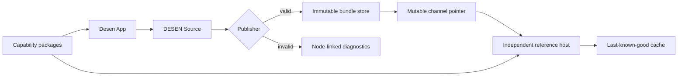

# Architecture

## System responsibility

The implementation keeps four authorities separate:

1. The protocol defines valid data and observable semantics.
2. Capability packages define trusted component, behavior, operation, and resource contracts.
3. Desen App owns editable design source for managed surfaces.
4. A host application owns executable code, authorization, integrations, and activation policy.



## Dependency direction

Cross-package imports are deny-by-default. A package may use relative imports within itself and
only the internal packages listed below:

| Package                 | Allowed internal dependencies                                                          |
| ----------------------- | -------------------------------------------------------------------------------------- |
| `protocol`              | none                                                                                   |
| `validator`             | `protocol`                                                                             |
| `publisher`             | `protocol`, `validator`                                                                |
| `catalog-sdk`           | `protocol`                                                                             |
| `runtime-core`          | `protocol`, `validator`                                                                |
| `runtime-react`         | `protocol`, `runtime-core`                                                             |
| `runtime-web`           | `protocol`, `validator`, `runtime-core`                                                |
| `editor-core`           | `protocol`, `validator`                                                                |
| `editor-web`            | `protocol`, `validator`, `catalog-sdk`, `editor-core`, `runtime-core`, `runtime-react` |
| `reference-catalog-web` | `protocol`, `catalog-sdk`, `runtime-react`                                             |
| `testkit`               | implementation package public APIs, except the `desen` facade                          |
| `desen`                 | protocol, validation, publication, runtime, catalog, and dedicated test APIs           |

Applications are composition roots but still have explicit allowlists. The reference host cannot
import editor or publisher packages, and the control plane cannot import renderer or editor
packages. Packages never import applications. Production package source never imports `testkit`;
only test code and the future dedicated `desen/test` facade may expose it.

`dependency-cruiser.config.cjs` is the executable authority for this table. Any new edge requires
an architecture review, a matching documentation change, and a negative boundary fixture.

`runtime-core` accepts a verified bundle, exact catalog set, and host ports. It produces
JSON-serializable state snapshots, diagnostics, and render plans. `runtime-react` translates those
plans into registered React components. This keeps protocol execution semantics reusable by a
future native renderer.

`catalog-sdk` owns only framework-neutral catalog documents, manifest builders, schema-derived
types, and contract derivation. A target capability package may publish inert parity metadata, but
a target renderer owns executable adapter registration; `runtime-react` therefore owns React
component adapter types and registries. A catalog package may depend on both, but React types never
cross the `catalog-sdk` public boundary. ADR 0007 records why parity metadata precedes, but never
replaces, the M05 registry.

## Reference capability artifact boundary

M03-T10 packages the exact reference sign-in slice as
`run.desen.reference.sign-in@0.1.0` for `web-react`. Its logical content-addressed artifact contains
the projected canonical Catalog and every regular file in the target package's clean `dist/**`
tree. JavaScript, declarations, and both source-map forms are included by path and exact bytes.
Two isolated builds and the workspace build must expose the same complete inventory and bytes.

The generated `catalog.json` is an inert, explicitly exported package data file. Its
`packageDigest` is calculated over the Catalog projection and distribution inventory; the final
digest and tuple are not embedded in a fingerprinted JavaScript file. The boundary deliberately
does not claim an npm archive, dependency closure, signature, distributor, or activation policy.
Those are later release and runtime responsibilities.

This artifact proves a stable contract-to-bytes identity but does not perform component lookup.
Executable registry construction, render-plan materialization, event bridging, command dispatch,
and operation execution remain owned by M05 and the host composition roots.

## Applications

### Desen App

The visual authoring product. It edits a DESEN Source directly, renders production adapters in the
canvas, provides schema-driven controls, switches between Design and Run modes, and sends valid
sources to the publisher.

### Reference Host Web

A separately built production-like application. It knows no authoring UI and contains no manual
managed-screen composition. It fetches a channel, verifies and stages a bundle, resolves exact
capabilities, then atomically activates it.

### Control Plane API

A small local-first service with three conceptual stores:

- editable sources;
- immutable bundles keyed by revision; and
- mutable channel pointers such as `preview` or `production-proof`.

Storage details are replaceable through repositories. The proof may begin with SQLite and local
immutable files; production storage is intentionally deferred.

### DESEN Developer Platform (`desen.run`)

The future developer documentation application. It will publish versioned protocol snapshots,
SDK guides, API reference, conformance results, compatibility tables, security guidance, and an
App-independent host integration quickstart. It is a developer surface, not a separate visual
authoring product.

## Platform-neutral host ports

The core receives capabilities through explicit interfaces for:

- operations and resources;
- navigation;
- tokens and environment values;
- storage and active-revision persistence;
- clock and scheduling;
- diagnostics; and
- platform adapter lookup.

No core API accepts `ReactNode`, DOM events, selectors, class names, arbitrary HTML, or executable
functions inside a DESEN document.

## Runtime value boundary

The runtime composes one factory-branded, detached, recursively frozen snapshot for `state`,
`context`, `resource`, `operation`, `event`, `item`, and `env`. Those maps come from an already
validated active surface and the current evaluation turn; the snapshot factory enforces inert
data, exact lifecycle/event envelopes, and limits rather than reopening the Bundle or Catalog.

Literal/reference/fallback resolution produces exactly one complete JSON candidate or an explicit
unresolved, invalid, or deferred result. Missing differs from JSON `null`; fallback cannot invent
an absent declaration root or revive an inactive event scope. References traverse own object
properties but never arrays, never trigger writes or host effects, and never evaluate
reference-shaped scope data a second time.

Snapshot input, ValueSpec input, and the final composed output all share the same bounded profile.
The output is detached and budgeted again so repeated references cannot amplify individually legal
values past depth, node-occurrence, or string limits. Exact consumer-schema validation still runs
after resolution and before any value reaches a target adapter.

## Activation sequence

```text
fetch channel
  → fetch immutable bytes
  → verify protocol and revision
  → resolve exact catalog packages
  → preflight references and limits
  → stage runtime indexes
  → durably store verified immutable bytes
  → atomically commit {active revision, previous-good revision, generation}
  → expose the committed active snapshot in memory
```

The durable activation record and the previous-good pointer are one transaction, not two writes.
The runtime must not expose the staged revision before that transaction commits. A failure or
crash before commit leaves the prior activation record untouched. A crash after commit but before
the in-memory notification recovers the committed revision on restart; it never constructs a
partially updated pointer set.

Concurrent activations use an expected generation or equivalent compare-and-swap guard so a stale
stage cannot overwrite a newer committed revision. Fault-injection tests cover failure before
every stage, transaction abort and quota failure, crash immediately before and after commit, stale
concurrent writers, and restart recovery.

## Mobile expansion

DESEN 0.1.0 proves exactly `web-react`. A future native implementation adds a target-specific
catalog and renderer while reusing protocol-observable trace vectors. It does not assume that Web,
iOS, and Android components are identical or that one source automatically has pixel-identical
output across platforms.
