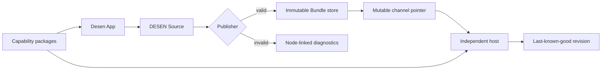

# Architecture

Last reviewed: 2026-09-10

## Purpose

DESEN separates human-authored design data from host-owned executable code. The reference
implementation proves one bounded `web-react` lifecycle: author a Source, validate and publish an
immutable Bundle, activate it transactionally, then execute it in a separately built host through
registered capabilities.

This document is the living system map. Detailed task-time decisions live in
[ADRs](../adr/), ambiguities in
[Protocol Findings](../plan/PROTOCOL-FINDINGS.md), and executable claims in the
[Proof Matrix](../proof/PROOF-MATRIX.md).

## System authorities

Four authorities remain separate:

1. The frozen protocol defines valid data and observable semantics.
2. Capability packages define trusted component, behavior, operation, and resource contracts.
3. Desen App owns editable Source for managed surfaces.
4. A host owns executable adapters, integrations, authorization, and activation policy.



No DESEN document selects an endpoint, credential, callback, package loader, executable module, or
arbitrary code. These remain host or application configuration.

## Dependency direction

Cross-package imports are deny-by-default. `dependency-cruiser.config.cjs` is the executable
authority for this table.

| Package                 | Allowed internal dependencies                                                          |
| ----------------------- | -------------------------------------------------------------------------------------- |
| `protocol`              | none                                                                                   |
| `validator`             | `protocol`                                                                             |
| `publisher`             | `protocol`, `validator`                                                                |
| `catalog-sdk`           | `protocol`                                                                             |
| `runtime-core`          | `protocol`, `validator`                                                                |
| `runtime-react`         | `protocol`, `validator`, `runtime-core`                                                |
| `runtime-web`           | `protocol`, `validator`, `runtime-core`                                                |
| `editor-core`           | `protocol`, `validator`                                                                |
| `editor-web`            | `protocol`, `validator`, `catalog-sdk`, `editor-core`, `runtime-core`, `runtime-react` |
| `reference-catalog-web` | `protocol`, `catalog-sdk`, `runtime-react`                                             |
| `testkit`               | implementation package public APIs, except the `desen` facade                          |
| `desen`                 | protocol, validation, publication, runtime, catalog, and dedicated test APIs           |

Packages never import applications. Production packages never import `testkit`. Applications are
composition roots with explicit allowlists:

- the reference host cannot import Desen App, editor, publisher, `testkit`, or the broad facade;
- the control plane cannot import renderer or editor packages; and
- Desen App may compose public package APIs but cannot become a hidden protocol/runtime owner.

A new dependency edge requires architecture review, a matching documentation change, and a
negative boundary fixture.

## Data lifecycle

### Authoring

`editor-core` edits the admitted `desen.source` graph directly through immutable deterministic
commands. Stable IDs live in Source; selection, viewport, drafts, and other editor-only state live
under root `authoring`. The production digest excludes exactly root `authoring`, while unknown
extensions remain inert Source data.

`editor-web` supplies platform transport and UI integration. Desen App owns routing, panels,
selection overlay, Design/Run mode, fixture controls, persistence composition, diagnostics, and the
visible publish action. Managed component rendering still passes through the same public Runtime
React and capability adapters used by the independent host.

### Validation and publication

The validator has separate structural and semantic stages. It returns stable diagnostics and
dynamic obligations; it never repairs unknown semantics silently.

The publisher:

1. captures finite Source bytes;
2. parses and structurally admits one Source;
3. resolves exact Catalog/package requirements;
4. validates static capability and execution contracts;
5. removes root `authoring` from the production projection;
6. canonicalizes the result deterministically; and
7. emits a complete immutable Bundle or no Bundle at all.

Failure returns diagnostics without partial publication authority. Source preservation is exact at
the parsed-value boundary; lexical whitespace and member ordering are not an authoring guarantee.

### Storage and activation

The control plane keeps three data classes distinct:

- editable Source bytes under compare-and-set generations;
- immutable Bundle bytes addressed by revision; and
- mutable channel pointers used only for discovery.

A channel is not activation authority. Activation independently verifies stored bytes, exact
packages, references, execution contracts, and finite limits before any durable state changes.

```text
fetch channel
  -> fetch immutable Bundle bytes
  -> verify protocol, revision, and Source corroboration
  -> resolve exact capability packages
  -> preflight references, execution contracts, and limits
  -> stage immutable runtime indexes
  -> atomically commit {active revision, previous-good revision, generation}
  -> expose the committed active snapshot in memory
```

The durable record and previous-good pointer are one transaction. Failure before commit leaves the
old record untouched. An uncertain outcome grants no new in-memory authority and requires recovery.
A crash after commit rebuilds the exact committed revision from the immutable store. Recovery never
guesses, silently repairs, or automatically promotes the previous-good revision.

### Runtime execution

`runtime-core` receives an authenticated Bundle, exact Catalog set, and explicit host ports. It
produces JSON-serializable state, diagnostics, and render plans. It owns resolution, predicates,
state, repeats, resources, operations, actions, limits, reactive publication, and stale-result
containment without importing React, DOM, CSS, browser, filesystem, or application code.

`runtime-react` translates a fully authenticated plan through a static adapter registry. It does
not inspect private component structure or invent unknown components. Adapter interaction authority
is commit-scoped and revoked by replacement, navigation, unmount, or disposal.

`runtime-web` provides browser-shaped ports and local recovery storage. The separately built host
fixes its Catalog, adapters, host bindings, channel, and integration policy outside DESEN data.

## Platform-neutral host ports

Core behavior enters through explicit interfaces for:

- operations and resources;
- navigation;
- tokens, context, and environment values;
- storage and active-revision persistence;
- clock and scheduling;
- diagnostics; and
- target adapter lookup.

No Core API accepts `ReactNode`, DOM events, selectors, class names, arbitrary HTML, or executable
functions inside a DESEN document.

## Application responsibilities

### Desen App

The visual authoring and publishing product. It owns application navigation, project bootstrap,
workspace layout, editor state, local integration choice, and user-visible lifecycle. Generic
Source editing, validation, publication, runtime, persistence, and managed rendering remain package
responsibilities.

### Reference Host Web

The independent proof host. Its browser bundle has no editor, publisher, testkit, control-plane, or
Desen App dependency. A separate application-owned server may consume the fixed local channel and
compose public verification/activation APIs, but the browser can request only a same-origin refresh
and cannot select authority inputs.

### Control Plane API

The bounded local Source, Bundle, channel, and activation service. It is not a remotely exposed
multi-tenant platform and provides no production authorization or package discovery claim.

### DESEN Developer Platform

The future `desen.run` documentation and integration surface. It is not a second visual authoring
product. External deployment and package publication remain blocked until G12 and explicit user
approval.

## Security and failure invariants

- Frozen protocol bytes are immutable.
- All untrusted inputs are finite and fail closed.
- Catalog identities and package digests are exact; there is no newest/best-match rule.
- Unknown capabilities never select placeholders.
- Publication is all-or-nothing.
- Staging is not activation.
- Failed activation preserves the last-known-good revision.
- Diagnostics are data and redact raw internal failures, credentials, and response bodies.
- Managed UI comes only from host-approved capability adapters.

These are engineering properties of the declared reference profile, not a production security
certification.

## M10 proven profile

G10 joins the complete Source → Publisher → control plane → independent-host path. Nine independent
Chromium journeys prove authoring, persistence, fixtures, success/failure/pending behavior,
publication, an unchanged-host update, invalid-candidate rejection, process-restart recovery, and
repeatable demo reset. The independent host source graph contains no handwritten managed-screen
tree. See [the terminal proof](../proof/DESEN-APP-M10-GATE.md).

The complete committed `packages/runtime-core` tree is frozen as
`3fa3613a3be63c749f40b6a0b55af5b40c675773`. This is an identity baseline for M11, not cached test
success.

## M11 extension contract

After SC-02 authorizes continuation, the Map and Sortable branches may add target capability
packages, adapters, resource/operation bindings, fixtures, and authored surfaces. They must not
modify Runtime Core. Each branch independently proves its capability boundary before both join in
the second surface. See the [task board](../plan/TASKS.md).

## Future native targets

DESEN 0.1.0 currently proves exactly `web-react`. A future native implementation adds a
target-specific Catalog and renderer while reusing protocol-observable trace vectors and the
platform-neutral packages. Pixel-identical Web/iOS/Android output is not promised.

## Historical detail

The full task-by-task M01–M10 architecture narrative remains in Git history and the linked
ADR/proof records. The immutable archive pointer is owned by the
[documentation standard](../standards/DOCUMENTATION-STANDARDS.md#document-lifecycle-and-ownership).
